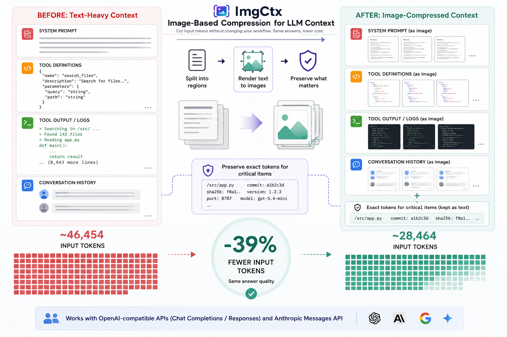
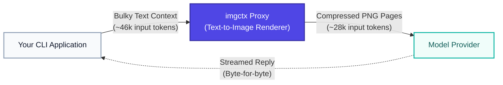
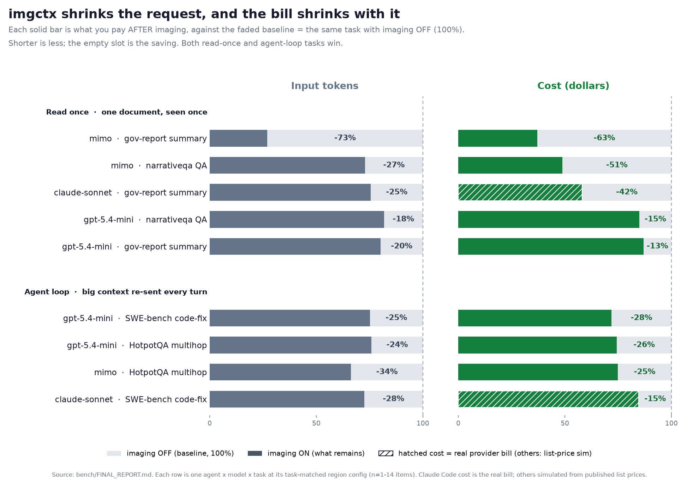
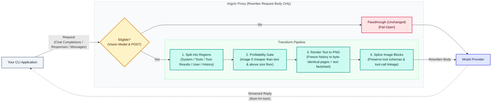

# imgctx

<p align="center">
  
</p>

**A transparent proxy that renders bulky text context into images before it reaches a vision-capable LLM, cutting input tokens without changing your coding-agent CLI.**

`imgctx` sits between a coding-agent CLI and the model provider. It intercepts each request, renders the large text regions (system prompt, tool docs, tool output, old history) into compact PNG pages, and forwards them as image blocks. Tool definitions, tool-call linkage, and multi-turn structure are preserved, so the agent behaves exactly as before while sending far fewer input tokens. It speaks both request shapes coding agents use: the **OpenAI-compatible** Chat Completions API (OpenCode, Codex), and the native **Anthropic Messages API** (Claude Code).

An image's token cost is fixed by its pixel area, not by how many characters it holds. Dense content (code, JSON, logs, tool output) packs many characters into few image tokens, so rendering it shrinks the request with no CLI change and no model fine-tuning. Point your CLI at the proxy, keep working, send fewer tokens.



_Measured HotpotQA median: 46,454 input tokens to 28,464, same answer._

## Does it actually work?

Two questions matter: does imaging cut tokens, and does it cut the bill. We measured both end to end through the real CLIs (OpenCode, Codex, Claude Code) across four benchmarks and five models. Same task, run twice, once with imaging off and once on.

**Yes on both, and the two move together.** Each row below is one agent, model, and task, with imgctx's regions matched to that task. The solid bar is what you use or pay *after* imaging, drawn against the faded track = the same task with imaging off (100%). The bar is visibly shorter than its track, so the shrink is the point: tokens fall (left panel), and the bill falls with them (right panel). The rows are grouped by task shape, and both groups win: read-once jobs (one document, seen once) and agent loops (a big context re-sent every turn). Claude Code's cost bars are the real provider bill (hatched); the rest are simulated from published list prices.



## Why it works, and why it matters

Agentic coding sessions re-send a large, mostly static context on every step: the system prompt, the tool schemas, files already read, the conversation so far. That context dominates the token count. Because image tokens are priced by pixel area rather than character count, rendering that bulk to a PNG replaces thousands of text tokens with a few hundred image tokens. The denser the text, the bigger the cut.

Two guarantees make it safe to leave in the path:

1. **Fail-open.** Any parse error, unknown request shape, or non-vision model falls straight through as plain passthrough. Turning imgctx on cannot break a run.
2. **Verbatim safety.** Vision models read rendered text as embeddings, not OCR, so exact strings (hashes, UUIDs, secrets) can fail silently. imgctx keeps identifier-dense and secret-bearing blocks as text, and for any block it does image, it carries the exact tokens (paths, hashes, versions, numbers, flags) alongside the image as plain text.

The payoff is largest exactly where agents are most expensive: long sessions with big repeated context, and one-shot jobs that paste a whole document. In both cases the request shrinks and, on the right configuration, so does the invoice.

## Architecture



The proxy only rewrites the request body; the response is streamed back untouched. A request is eligible only if it targets a vision model over POST, and anything else (parse errors, unknown shapes, non-vision models) falls straight through, so imgctx cannot break a run. Eligible requests pass through the pipeline above: each region is imaged only when the profitability gate says the image is cheaper than the text, and settled history turns are frozen into byte-identical PNGs so the provider's automatic prompt cache can reuse them turn after turn.

## What the model actually sees

imgctx images each region **separately** and splices it back in its original place. It never merges regions into one image, that would break tool-call linkage and the byte-identical history caching. Below is one real request with every region turned on. Each row is a separate image block sent inside the request, in its own position.

The images are rendered by the actual proxy. The small red `\n` marks a real newline: imgctx draws it so the model can tell a real line break from a soft wrap, and the dense packing is part of why the token count drops.

| Region                       | What imgctx does with it                                                                                              | The image it sends |
| ---------------------------- | --------------------------------------------------------------------------------------------------------------------- | ------------------ |
| **System prompt**      | Rendered to its own image in the system slot.                                                                         |                    |
| **Tool definitions**   | Its own image. The`tools[]` list is kept as structure, so tool calls still validate.                                |                    |
| **Tool output**        | Its own image, kept attached to the tool call that produced it.                                                       |                    |
| **Older user message** | Imaged in place. The live, most recent message always stays as text.                                                  |                    |
| **Settled history**    | Old, closed turns frozen into byte-identical, cacheable images (this request produced two such chunks; one is shown). |                    |

## Results: ON vs OFF

We tested imgctx on four public benchmarks. A benchmark is just a standard set of tasks that researchers use so results can be compared fairly. These four were picked to cover the two shapes of work that matter for cost:

- **gov-report** (summarize a long document): the agent is given one long government report and asked to summarize it. It reads the document once. Read-once.
- **narrativeqa** (answer a question about a long story): the agent is given one long story or document and asked a question about it. Read-once.
- **HotpotQA** (answer a question that needs several facts): a trivia-style question that can only be answered by combining facts from more than one source. The agent takes a few steps, re-sending its context each step. Agent loop.
- **SWE-bench Lite** (fix a real software bug): the agent is dropped into a real open-source codebase with a real bug report and must edit the code to fix it. Many steps, the largest context. Agent loop.

Each row below is one task, with imgctx's regions matched to that task's shape (see the config guide below).

**What the region columns mean.** imgctx does not image the whole prompt blindly. It splits each request into five regions and decides, per region, whether to render it to images or leave it as text. The five columns below are those regions, a check mark means that region was rendered to images for this run, and a blank means it was kept as text:

- **SYS**: the system prompt (fixed instructions).
- **TOOLS**: the tool and function definitions.
- **TOOL_RES**: tool outputs (file reads, command output, search results).
- **USER**: the user's own message text.
- **HIST**: the earlier conversation turns.

| Agent       | Model         | Task               | Shape      | SYS | TOOLS | TOOL_RES | USER | HIST | Input tokens |                    Cost |
| ----------- | ------------- | ------------------ | ---------- | :-: | :---: | :------: | :--: | :--: | -----------: | ----------------------: |
| OpenCode    | mimo          | gov-report summary | read once  | ✓ |  ✓  |    ✓    |  ✓  |  ✓  |       -72.9% |            -62.9% (sim) |
| OpenCode    | mimo          | narrativeqa QA     | read once  |    |      |    ✓    |  ✓  |  ✓  |       -27.1% |            -51.2% (sim) |
| Claude Code | claude-sonnet | gov-report summary | read once  |    |      |    ✓    |  ✓  |  ✓  |       -24.5% | **-41.9% (real)** |
| Claude Code | claude-sonnet | narrativeqa QA     | read once  |    |      |    ✓    |  ✓  |      |          n/a | **-29.9% (real)** |
| Codex       | gpt-5.4-mini  | SWE-bench code-fix | agent loop | ✓ |  ✓  |    ✓    |  ✓  |  ✓  |       -24.8% |            -28.1% (sim) |
| Codex       | gpt-5.4-mini  | HotpotQA multihop  | agent loop | ✓ |  ✓  |    ✓    |  ✓  |  ✓  |       -24.1% |            -25.6% (sim) |
| OpenCode    | mimo          | HotpotQA multihop  | agent loop | ✓ |  ✓  |    ✓    |  ✓  |  ✓  |       -33.7% |            -25.2% (sim) |
| Claude Code | claude-sonnet | SWE-bench code-fix | agent loop |    |      |    ✓    |      |      |       -27.5% | **-15.3% (real)** |

Answer quality held: where tasks are scored (F1, answer-contains, summary), correctness with imaging on stayed within noise of the off baseline, with no rise in tool-call errors or HTTP failures. Cost marked **(real)** is the actual dollar amount Claude Code reports (`total_cost_usd`). Cost marked **(sim)** is simulated from the provider's published list prices, because those runs go through a subscription, so the provider does not return a per-request dollar cost. The token numbers are real in every row.

## Quick start

Requirements: Python 3.10+, `poppler-utils` (`pdftoppm`) on `PATH`, and an upstream with a multimodal model.

```bash
git clone https://github.com/NatBrian/image-token-compression
cd image-token-compression
pip install -e .
imgctx serve            # run the proxy on http://127.0.0.1:8787
imgctx stats            # summarize tokens saved from the event log
imgctx watch            # live per-call table: tokens, cache split, cost, as requests flow
imgctx version          # print the installed version
```

`imgctx serve` also takes `--port`, `--host`, and `--upstream <url>` to override those settings on the command line. `imgctx stats` and `imgctx watch` take `--path <event-log>` (default `~/.imgctx/events.jsonl`), and `imgctx watch` takes `--pricing <json>` (or the `IMGCTX_PRICING` env var) to simulate a dollar cost per call.

### Tested coding agents

| CLI                   | API shape imgctx speaks            | Auth options                             | Status |
| --------------------- | ---------------------------------- | ---------------------------------------- | :----: |
| **OpenCode**    | OpenAI-compatible Chat Completions | provider API key, or ChatGPT OAuth relay | tested |
| **Claude Code** | native Anthropic Messages          | API key, or Claude subscription OAuth    | tested |
| **Codex CLI**   | native Responses API               | ChatGPT OAuth relay                      | tested |

Models validated: `claude-sonnet`, `claude-haiku`, `gpt-5.4-mini`, `mimo-v2.5-free`, `gemini-3.1-flash-lite`. Any OpenAI-compatible CLI works the same way as OpenCode: point its base URL at the proxy and set `IMGCTX_UPSTREAM_BASE` to the real endpoint.

### OpenCode, OpenAI-compatible API

Point OpenCode's provider base URL at the proxy (`~/.config/opencode/opencode.json`), and set the real upstream:

```json
{
  "$schema": "https://opencode.ai/config.json",
  "provider": {
    "opencode": { "options": { "baseURL": "http://127.0.0.1:8787/v1" } }
  }
}
```

```bash
IMGCTX_UPSTREAM_BASE=https://opencode.ai/zen/v1 imgctx serve
opencode run --model opencode/mimo-v2.5-free "read src/app.py and explain what it does"
```

### OpenCode, ChatGPT (OpenAI) OAuth subscription

Route OpenCode through a ChatGPT Plus/Pro/Go subscription instead of an API key. OpenCode's built-in `openai` provider hardcodes a fetch override to `chatgpt.com`, so use a **custom** OpenAI-compatible provider to dodge it. imgctx then reads your OAuth tokens from OpenCode's `auth.json`, converts Chat Completions to the Responses API the backend speaks, and injects the auth headers.

Prerequisite: `opencode login openai` completed, so `~/.local/share/opencode/auth.json` holds a valid `openai` entry.

```json
{
  "$schema": "https://opencode.ai/config.json",
  "provider": {
    "imgctx-openai": {
      "npm": "@ai-sdk/openai-compatible",
      "name": "OpenAI (via imgctx)",
      "options": { "baseURL": "http://localhost:8787/v1", "apiKey": "oauth-relay" },
      "models": { "gpt-5.4-mini": { "name": "GPT 5.4 Mini (imgctx)" } }
    }
  }
}
```

```bash
IMGCTX_OPENAI_OAUTH=1 imgctx serve      # must listen on the base-URL port (8787)
opencode run --model imgctx-openai/gpt-5.4-mini "read src/app.py and explain what it does"
```

The proxy injects `Authorization: Bearer <access>` and `ChatGPT-Account-Id` from `auth.json` and refreshes on a 401. If OpenCode reports `Unable to connect`, the proxy is not on the base-URL port, or `IMGCTX_OPENAI_OAUTH=1` was not set.

### Claude Code

imgctx speaks the native Anthropic Messages API, so Claude Code routes through it directly:

```bash
ANTHROPIC_BASE_URL=http://127.0.0.1:8787 claude -p "fix the failing test in src/app.py"
```

The proxy forwards to `https://api.anthropic.com` and, for subscription auth, injects the OAuth token from `~/.claude/.credentials.json` (Claude Code strips its own credential from non-canonical hosts). For coding work, keep the system prompt as text (`IMGCTX_SYSTEM=0`): it carries exact cwd and tool-use rules, is already served cheaply from cache, and imaging it is low reward. On Anthropic, match the regions to the task (see Configuration and Known limitations below); it cuts real dollars on read-once work.

### Codex CLI (ChatGPT OAuth subscription)

Codex speaks the Responses API natively, so imgctx needs no translation: it images the Responses `input` in place (preserving every `function_call`, `function_call_output`, and `reasoning` item so the agent loop stays intact), injects the OAuth headers, and streams the native SSE straight back.

Prerequisite: `codex login` completed, so `~/.codex/auth.json` holds valid `tokens`. Two settings matter, both handled below: do not set `requires_openai_auth = true` (it sends Codex straight to `chatgpt.com`, bypassing the proxy), and select the provider with `model_provider`, not `default_model_provider`.

```toml
model = "gpt-5.4-mini"
model_provider = "imgctx"        # NOT default_model_provider

[model_providers.imgctx]
name = "imgctx"
base_url = "http://127.0.0.1:8787/v1"
wire_api = "responses"
env_key = "IMGCTX_DUMMY_KEY"     # any non-empty value; imgctx supplies real OAuth
```

```bash
IMGCTX_DUMMY_KEY=x IMGCTX_CODEX_OAUTH=1 imgctx serve
IMGCTX_DUMMY_KEY=x codex exec "read src/app.py and explain what it does"
```

The proxy injects the OAuth headers from `~/.codex/auth.json` and refreshes on a 401. A harmless `GET /v1/models` 404 in Codex's log is just its optional model-list refresh.

### Other providers, or let your coding agent set it up

Any OpenAI-compatible CLI works: point its base URL at `http://127.0.0.1:8787/v1` and set `IMGCTX_UPSTREAM_BASE` to the real endpoint. To have an AI coding assistant wire it up for you, paste this prompt into your agent:

```text
Set up the "imgctx" transparent proxy (https://github.com/NatBrian/image-token-compression)
in front of my coding-agent CLI so my requests send fewer input tokens.

1. Clone https://github.com/NatBrian/image-token-compression and `pip install -e .`
   (needs Python 3.10+ and poppler-utils / pdftoppm on PATH).
2. Read the README's Quick start and Configuration sections to learn the env vars.
3. Detect which CLI I use (OpenCode, Codex, Claude Code, or another OpenAI-compatible
   tool) and configure it to route through the proxy at http://127.0.0.1:8787:
     - OpenAI-compatible CLIs: set the provider baseURL to http://127.0.0.1:8787/v1
       and start the proxy with IMGCTX_UPSTREAM_BASE set to the real endpoint.
     - Claude Code: set ANTHROPIC_BASE_URL=http://127.0.0.1:8787.
     - Codex: add an imgctx model_provider with wire_api=responses.
4. Start the proxy (`imgctx serve`), run one real request, then `imgctx stats` to
   confirm tokens dropped. Match the imaged regions to my task shape using the
   README's Configuration and Known limitations guidance.
```

## Configuration

All settings are environment variables. The ones you are most likely to set are in **bold**. Defaults are sensible, so most setups only need the upstream and the per-region toggles.

| variable                                                                                                             | default                                                       | meaning                                                                         |
| -------------------------------------------------------------------------------------------------------------------- | ------------------------------------------------------------- | ------------------------------------------------------------------------------- |
| **`IMGCTX_UPSTREAM_BASE`**                                                                                   | `https://opencode.ai/zen/v1`                                | real upstream for the OpenAI-compatible path; set this to your provider         |
| `IMGCTX_UPSTREAM_KEY`                                                                                              | (empty)                                                       | Authorization value for the upstream; empty passes the client's own key through |
| `IMGCTX_ANTHROPIC_UPSTREAM`                                                                                        | `https://api.anthropic.com`                                 | upstream for the Claude Code (Messages API) path                                |
| `IMGCTX_HOST` / `IMGCTX_PORT`                                                                                    | `127.0.0.1` / `8787`                                      | bind address and port (the port must match the CLI's base URL)                  |
| `IMGCTX_MODELS`                                                                                                    | `mimo,gemini,gpt-4,gpt-5,qwen,glm,claude,haiku,sonnet,opus` | vision allowlist (substring match);`off` disables all imaging                 |
| **`IMGCTX_SYSTEM` / `IMGCTX_TOOLS` / `IMGCTX_TOOL_RESULTS` / `IMGCTX_USER_TEXT` / `IMGCTX_HISTORY`** | `1`                                                         | per-region toggles; match these to your task (see below)                        |
| `IMGCTX_MIN_TOOL_RESULT_CHARS` / `IMGCTX_MIN_USER_TEXT_CHARS`                                                    | `6000`                                                      | per-region size floor                                                           |
| `IMGCTX_MIN_SYSTEM_CHARS` / `IMGCTX_MIN_TOTAL_CHARS`                                                             | `2000`                                                      | slab and whole-request floors                                                   |
| `IMGCTX_DPI`                                                                                                       | `96`                                                        | render DPI (lower is denser, higher is more legible)                            |
| `IMGCTX_MAX_PIXELS`                                                                                                | `1000000`                                                   | per-image pixel cap (avoids provider downscaling)                               |
| `IMGCTX_KEEP_SHARP` / `IMGCTX_FACTSHEET`                                                                         | `1`                                                         | verbatim-safety features                                                        |
| `IMGCTX_ENABLED`                                                                                                   | `1`                                                         | master switch (`0` is pure passthrough)                                       |
| `IMGCTX_TIMEOUT`                                                                                                   | `600`                                                       | upstream request timeout, seconds                                               |
| `IMGCTX_LOG_PATH`                                                                                                  | `~/.imgctx/events.jsonl`                                    | event log that`imgctx stats` and `imgctx watch` read                        |
| `IMGCTX_OPENAI_OAUTH`                                                                                              | `0`                                                         | relay OpenCode through a ChatGPT OAuth subscription                             |
| `IMGCTX_OPENAI_CREDENTIALS`                                                                                        | `~/.local/share/opencode/auth.json`                         | OpenCode OAuth token file                                                       |
| `IMGCTX_OPENAI_OAUTH_UPSTREAM`                                                                                     | `https://chatgpt.com/backend-api/codex`                     | ChatGPT backend base for the OpenCode relay                                     |
| `IMGCTX_CODEX_OAUTH`                                                                                               | `0`                                                         | relay the Codex CLI through a ChatGPT OAuth subscription                        |
| `IMGCTX_CODEX_CREDENTIALS`                                                                                         | `~/.codex/auth.json`                                        | Codex CLI OAuth token file                                                      |
| `IMGCTX_ANTHROPIC_CREDENTIALS`                                                                                     | `~/.claude/.credentials.json`                               | Claude Code OAuth token file (subscription relay)                               |

<details>
<summary><strong>Advanced tuning</strong> (defaults are fine for almost everyone)</summary>

| variable                                                | default               | meaning                                                                      |
| ------------------------------------------------------- | --------------------- | ---------------------------------------------------------------------------- |
| `IMGCTX_ANTHROPIC_OAUTH_INJECT`                       | `1`                 | re-inject the stored Claude OAuth bearer on the Messages path                |
| `IMGCTX_ANTHROPIC_CACHE_IMAGES`                       | `1`                 | mark the fixed system+tools image cacheable so it cache-reads on later turns |
| `IMGCTX_HISTORY_KEEP_TAIL`                            | `6`                 | most recent turns kept as text                                               |
| `IMGCTX_HISTORY_MIN_PREFIX`                           | `6`                 | minimum settled turns before history is frozen to images                     |
| `IMGCTX_HISTORY_FREEZE_CHUNK`                         | `6`                 | turns per frozen, cacheable history image chunk                              |
| `IMGCTX_CHARS_PER_TOKEN`                              | `4.0`               | text-cost estimate used by the profitability gate                            |
| `IMGCTX_PIXELS_PER_TOKEN`                             | `750`               | image-cost estimate (pixels per token) used by the gate                      |
| `IMGCTX_IMAGE_MARGIN`                                 | `1.15`              | safety margin on the image estimate (biases toward passthrough)              |
| `IMGCTX_MAX_IMAGES` / `IMGCTX_MAX_IMAGES_PER_BLOCK` | `60` / `24`       | caps on images per request and per single block                              |
| `IMGCTX_FONT` / `IMGCTX_CJK_FONT`                   | bundled DejaVu / none | render fonts (set a CJK font to render CJK glyphs)                           |
| `IMGCTX_FONT_SIZE` / `IMGCTX_LINE_HEIGHT`           | `9.0` / `10.0`    | render text size and line spacing                                            |
| `IMGCTX_NEWLINE_MARKER`                               | `1`                 | draw a visible newline marker so soft wraps are distinguishable              |
| `IMGCTX_IMAGE_DETAIL`                                 | `high`              | image-detail hint sent to the provider                                       |
| `IMGCTX_LOG`                                          | `1`                 | write the event log (the source for`stats` and `watch`)                  |
| `IMGCTX_CAPTURE_DIR`                                  | (empty)               | if set, dump full request bodies here for debugging                          |

</details>

**Which regions to image, matched to the task.** The five regions from the results table map to five toggles: `IMGCTX_SYSTEM`, `IMGCTX_TOOLS`, `IMGCTX_TOOL_RESULTS`, `IMGCTX_USER_TEXT`, `IMGCTX_HISTORY`. Set each to `1` to render that region to images, or `0` to keep it as text. The right choice depends on your provider and task:

- **No cache-write premium** (OpenAI, Codex, mimo, gemini): image everything (all five on). The one exception is mimo on long agent loops, where imaging can make it emit more output; there, image only tool outputs, user text, and history (system and tools off).
- **Cache-write premium** (Anthropic / Claude Code): image only big, unique, read-once content. For one-shot document tasks, image tool outputs, user text, and history but keep system and tools as text. On long agent loops, keep the repeated prefix (system, tools, history) as text and image only fresh tool outputs.

## Known limitations

imgctx is a targeting tool, not a magic switch. There is one thing that can surprise you. This section explains it in plain words, and what to do so it never bites you.

### Fewer tokens does not always mean a smaller bill

imgctx always makes your request smaller (fewer input tokens). That is guaranteed on every provider. Turning those smaller requests into a smaller bill depends on one detail: how your provider prices text you send over and over.

**A 30-second primer on the "prompt cache".** When a coding agent works, it re-sends almost the same big prompt on every step (the instructions, the list of tools, files it already read). To avoid charging you full price for that repetition, providers keep a cache:

- The **first** time they see a chunk of text, they store it. This is a **cache write**. It costs a little more than normal, like paying to file a document in a cabinet.
- **Every later** time you send the exact same text, they reuse the stored copy. This is a **cache read**. It is very cheap, often about one tenth of the normal price, like photocopying the document you already filed.
- The catch: the match must be exact. Change one character and it counts as brand-new text, so it is a new write, not a cheap read.

**Why imaging can cost more in one specific case.** An image is brand-new bytes, different from the text it replaced. So if you turn a chunk of text into an image when the provider was already serving that text cheaply from cache, you swap a cheap **cache read** for a pricier **cache write**. You send fewer tokens, but each one now costs more, and the bill can rise even as the token count drops. Our benchmarks show this in exactly one situation: a **long agent loop** (the same big context re-sent every step) on a provider that **charges extra for cache writes** (today that means Anthropic / Claude Code).

**On every other provider and task, imaging cuts the bill too.** Providers like OpenAI, Codex, and the OpenCode models charge nothing extra for a cache write, so there is no penalty and the token cut flows straight to the bill. And read-once work (summarize or ask questions about one document) wins everywhere, including on Anthropic, because that text was never cached in the first place, so imaging simply makes the one-time cost smaller.

**What you should do (the config guide above spells this out):**

- **Provider does not charge extra for cache writes** (OpenAI, Codex, mimo, gemini): turn imaging on for everything.
- **Provider does charge extra** (Anthropic / Claude Code): image only the big, unique, read-once parts (a pasted document, fresh tool output), and leave the repeated prefix as text (`IMGCTX_SYSTEM=0`, and keep tools and history as text).

You are never flying blind: your provider reports the dollar cost, so you can run your own workload both ways and keep the cheaper one. This is a pricing quirk of one provider on one kind of task, not a flaw in the idea, and the token saving is always real. Full numbers and the per-cost breakdown are in [`bench/FINAL_REPORT.md`](bench/FINAL_REPORT.md).

### Other limitations

- **Exact strings inside images can be misread.** A vision model reads a picture of text by understanding it, not by copying it character for character, so byte-exact values (hashes, UUIDs, secrets) can come back slightly wrong, and silently. imgctx reduces this by keeping identifier-heavy and secret-bearing blocks as text and by attaching the exact tokens alongside each image, but it does not eliminate it. Keep byte-critical content as text.
- **Results depend on the reader model.** Some models read rendered text better than others. Stick to models you have checked (the allowlist), because a weaker model can lose some accuracy on hard tasks.
- **Only dense text is worth imaging.** Short or sparse text has little to gain, so the built-in profitability gate skips it and leaves it as text. The wins come from big, dense content (code, JSON, logs, long documents).
- **A little extra latency.** Rendering text to images adds a moment before a large request is sent, and the model spends a little more time reading images.
- **Small samples.** Each measured result is a handful of items, so trust the direction of an effect more than the exact percentage, which will move with more data. This is engineering evidence, not a peer-reviewed study.

## Inspired by

- *Text or Pixels? It Takes Half: On the Token Efficiency of Visual Text Inputs in Multimodal LLMs* ([arXiv:2510.18279](https://arxiv.org/abs/2510.18279))
- *LensVLM: Selective Context Expansion for Compressed Visual Representation of Text* ([arXiv:2605.07019](https://arxiv.org/abs/2605.07019))

## License

MIT, see [LICENSE](LICENSE).
