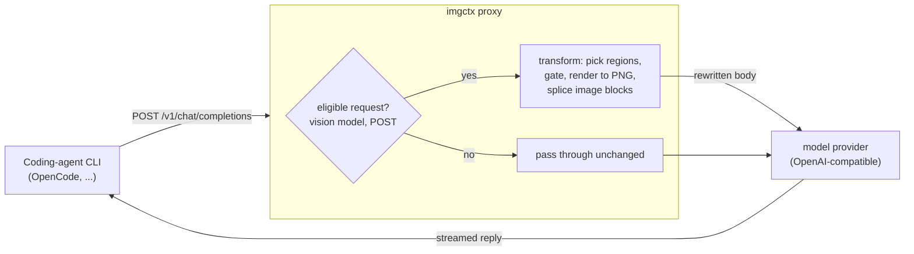

# imgctx

**A transparent proxy that renders bulky text context into images before it reaches a vision-capable LLM, cutting input tokens without changing your coding-agent CLI.**

`imgctx` sits between a coding-agent CLI and the model provider. It intercepts each request, renders the large text regions (system prompt, tool docs, tool output, old history) to compact PNG pages, and forwards them as image blocks. Tool definitions, tool-call linkage, and multi-turn structure are preserved, so the agent behaves exactly as before while sending far fewer input tokens. It speaks two request shapes: the **OpenAI-compatible** Chat Completions API (for example [OpenCode][OpenCode]) and the **native Anthropic Messages API** used by **Claude Code**.

> **Fewer tokens is not always fewer dollars.** The token cut is real on every provider, but whether it lowers your bill depends on how the provider prices cache. On providers that already cache repeated text cheaply (Anthropic), imaging can cost *more* in real dollars, see [When imaging pays](#when-imaging-pays-and-when-it-does-not). Measure real cost before enabling it.

```
your CLI  ->  imgctx proxy  ->  model provider
              (renders bulk text to images,
               streams the reply back untouched)
```

## Why it matters

An image's token cost is fixed by its pixel area, not by how many characters it contains. Dense content (code, JSON, logs, tool output) packs many characters into few image tokens. Agentic coding sessions re-send a large, mostly-static context on every step (system prompt, tool schemas, prior file reads), so that context dominates the token count. Rendering it to images cuts that token count with no change to the CLI and no model fine-tuning.

Whether the token cut becomes a **dollar** cut depends on the provider's pricing. Where repeated text is billed at full rate (no prompt cache), the saving is direct. Where the provider already caches repeated text cheaply (Anthropic), imaging can cost more in real dollars because it trades cheap cache-reads for cache-writes, quantified in [When imaging pays](#when-imaging-pays-and-when-it-does-not).

## Results

Measured end-to-end on **HotpotQA** multihop questions driven through the **real OpenCode CLI** (`opencode run`, model `mimo-v2.5-free`). Same questions run twice, once with `imgctx` and once in pure passthrough, logged by the same proxy.


| metric                             | without imgctx | with imgctx |           change |
| ---------------------------------- | -------------: | ----------: | ---------------: |
| median input tokens / question     |         46,454 |      28,464 | **-38.7%** |
| matched-trajectory subset (9/10 q) |        418,307 |     255,498 | **-38.9%** |
| exact match                        |           7/10 |        7/10 |                0 |
| answer-contains-gold               |           7/10 |        8/10 |               +1 |

Accuracy holds (no exact-match loss) on a hard multihop set with a small, free 9B-class reader.

### Isolated compression (single request)

To isolate the compression from agent nondeterminism, the same payload is sent once as text and once imaged (`python -m bench.ab`), and the provider-billed `prompt_tokens` compared. A needle is embedded in each payload to confirm the model still reads it.

| payload      | text tokens | imaged tokens |           change | needle recalled |
| ------------ | ----------: | ------------: | ---------------: | :-------------: |
| dense code   |      18,138 |         5,288 | **-70.8%** |       yes       |
| 51 KB JSON   |      24,565 |         5,477 | **-77.7%** |       yes       |
| sparse prose |       3,615 |         2,159 |           -40.3% |       yes       |

On a real captured OpenCode request (system prompt + 34 tool schemas + a file-read result), the residual text that stays as tokens drops from **123,656 to 15,097 characters (-87.8%)**, with all 34 tools preserved and tool calling intact.

### Bounding agent loops

Agentic runs sometimes loop (the model re-reads and retries), and each looped step re-sends the accumulating imaged context, which could cost more end-to-end. `imgctx` freezes old, settled turns into byte-identical images the provider caches (it reports `cached_tokens` on them), so looped sessions stay bounded. In the run above, the end-to-end input-token total across every call was **-32.6%** versus passthrough, and the one question that did loop stayed cheap because its old turns were served from cache. Agent looping is nondeterministic and n is small, so treat the end-to-end figure as indicative; the mechanism (byte-stable, cacheable history images) is verified separately.

### Dollar cost

`mimo-v2.5-free` is free, so the saving is measured in tokens. Applied to a paid model's input-token price, the median cut of **17,990 input tokens per question** is worth:


| input price ($ / 1M tokens) | saved per 1,000 questions |
| --------------------------- | ------------------------: |
| $0.50                       | $9                        |
| $1.25                       | $22                       |
| $3.00                       | $54                       |
| $5.00                       | $90                       |
| $10.00                      | $180                      |

This counts input tokens only. Some providers bill image inputs on a separate schedule; on `mimo` the image cost is folded into `prompt_tokens`, so the measured token figure already includes it. Reproduce every number with `python -m bench.hotpot_experiment --n 10 && python -m bench.make_report && python docs/make_charts.py`.

## When imaging pays (and when it does not)

Imaging always cuts **tokens**. Whether it also cuts **dollars** depends on one thing: does your provider already give you a cheap price on repeated text? This section is the honest, measured answer, so you can point `imgctx` at the jobs where it wins on both.

### The one idea to understand: prompt caching

Some providers keep a **prompt cache**. The first time they see a chunk of text they charge a one-time *write* price to store it; every later request that repeats that chunk is served from cache at a steep discount (a *read*). On Anthropic, a cache-read costs about **0.1x** the normal input rate, and a cache-write costs about **1.25x to 2x**.

Agent coding sessions are the ideal case for that cache: the same system prompt, the same tool schemas, and the growing history repeat on every single turn. After turn one, the provider is already serving almost all of it at the ~0.1x read rate.

### Why fewer tokens can still cost more (on a caching provider)

Here is the trap, step by step:

1. **Without `imgctx`**, that big repeated context is *text the provider has already cached*. You pay the cheap **read** price (~0.1x) for it every turn.
2. **With `imgctx`**, the same context is now an **image**. The image is far fewer tokens, but it is *brand-new content the provider has never seen*, so it is billed as a **write** (~1.25x to 2x), and image bytes cannot reuse the text cache.
3. So you traded a large number of **very cheap** tokens for a small number of **expensive** tokens. The token count drops, but the price-per-token rises more, and the bill goes up.

In short: on a caching provider, `imgctx` is competing against a price (0.1x) that it simply cannot beat, and the act of imaging turns cheap reads into pricier writes.

Measured through the **real Claude Code CLI** (`claude -p`, model `claude-sonnet-5`), each task run twice (compression OFF passthrough vs ON). **Dollars are Claude Code's own reported `total_cost_usd`**, not a price formula, and tokens are Claude's own reported usage:


| benchmark (n=5)               | input tokens | real cost (`total_cost_usd`) |
| ----------------------------- | -----------: | ---------------------------: |
| SWE-bench Lite (long agentic) | **-24.7%**   | **+26.5%**                   |
| HotpotQA (short read-a-doc QA)| **-35.1%**   | **+44.0%**                   |

Tokens fall on both; dollars rise on both. Short one-or-two-turn tasks are hit hardest, because there are no later turns over which to spread the one-time image write (long agentic loops re-read the frozen prefix many times, which softens the hit but does not erase it). Every run stayed correct: 0 tool-call errors, 0 HTTP 400s. The economics turn negative, not the behavior.

### So how should you use it

Use `imgctx` where the token cut becomes a real dollar cut, and skip it where the provider is already doing the saving for you:

| Use it here (cuts tokens **and** cost) | Skip it here (caching already wins) |
| --- | --- |
| Providers with **no prompt cache**, where every repeated token is billed at full rate every turn (for example the OpenCode/`mimo` path, where `imgctx` measured **-33% to -47%** end-to-end). | Providers with **aggressive prompt caching** (Anthropic / Claude Code) on repetitive agentic loops. The repeated context is already ~0.1x; imaging can only make it pricier. |
| **Cheap-vision** models, where image tokens are priced low relative to text. | Cache-cheap models (Claude Opus/Haiku/Sonnet), which also add a small image "read tax" on top. |
| **Send-once, large** inputs (a big document or log you pass a single time, not re-sent every turn). With nothing cached to undercut, imaging the giant paste is a straight win, and can keep you **under the context-window limit** when the raw text would not fit. | Short chat-style turns where the context is small to begin with, there is little to compress and the gate will skip it anyway. |

**Rule of thumb:** ask *"does my provider bill repeated text cheaply?"* If **no**, `imgctx` saves both tokens and money. If **yes**, the provider already captured the cost saving, so use `imgctx` only for the token-count / context-window benefit, or leave it off (`IMGCTX_ENABLED=0`) and pay the cache-read price. Either way you are never worse off than an informed choice, because both arms are measurable from your provider's own `total_cost_usd`.

This is why `imgctx` is best thought of as a **targeting tool, not an always-on switch**: it turns bulky text into cheap image tokens, which is a clear win exactly when text is not already cheap. Reproduce the Anthropic numbers with `python -m bench.swebench_experiment --n 5 --model sonnet` and `python -m bench.hotpot_claude_experiment --n 5 --model sonnet`, then `python -m bench.combined_report && python docs/make_anthropic_chart.py`.

## Demo

```console
$ imgctx serve
imgctx v0.1.0 proxy on http://127.0.0.1:8787
  -> upstream https://opencode.ai/zen/v1

# point OpenCode's provider at the proxy (examples/opencode.json), then:
$ opencode run --model opencode/mimo-v2.5-free \
    "read documents.md and answer: were Scott Derrickson and Ed Wood the same nationality?"
> Read documents.md
yes

# same question, measured by the proxy:
#   without imgctx : 46,283 input tokens
#   with imgctx    : 28,552 input tokens   (-38%, same answer)
```

## Architecture



The proxy only rewrites the request body. The response is streamed back byte-for-byte. Any parse error, unknown shape, or unsupported model falls through as a plain passthrough.

## How it works

Each request is split into regions, and each region is compressed only when it pays off:

1. **System prompt** and **tool documentation** are rendered to images. Tool schemas in `tools[]` are kept as JSON but stripped to their structure (names, parameter types, `required`, `enum`), so the provider can still validate tool calls while the verbose descriptions move into pixels.
2. **Tool outputs** (file reads, command output) and **older user messages** are imaged in place; the live (most recent) user turn always stays as text for full fidelity.
3. **Old conversation history** is collapsed: the settled, closed prefix (never cutting between a tool call and its result) is frozen into byte-identical image chunks that the provider caches, while the recent tail stays as text.

Two guards keep it safe and profitable:

- **Profitability gate.** Image-token cost is proportional to pixel area. A block is imaged only when its estimated image cost is below its text-token cost, and only above a per-region size floor, so sparse or tiny blocks stay text.
- **Verbatim safety.** Vision models read rendered text as embeddings, not OCR, so exact strings (hashes, UUIDs, secrets) can fail silently. `imgctx` keeps identifier-dense and secret-bearing blocks as text, and for any block it does image, it extracts the exact tokens (paths, hashes, versions, numbers, flags) and carries them alongside the image as plain text.

Rendering is deterministic: the same text always produces the same PNG bytes, which is what lets frozen history images hit the provider's automatic prompt cache turn after turn.

## Quick start

Requirements: Python 3.10+, `poppler-utils` (`pdftoppm`) on `PATH`, and an OpenAI-compatible upstream with a multimodal model.

```bash
git clone https://github.com/NatBrian/image-token-compression
cd image-token-compression
pip install -e .
imgctx serve            # proxy on http://127.0.0.1:8787
```

### Use it in a coding-agent CLI

Point the CLI's provider base URL at the proxy. For OpenCode (`~/.config/opencode/opencode.json`, see `examples/opencode.json`):

```json
{
  "$schema": "https://opencode.ai/config.json",
  "provider": {
    "opencode": { "options": { "baseURL": "http://127.0.0.1:8787/v1" } }
  }
}
```

Then use OpenCode as usual:

```bash
opencode run --model opencode/mimo-v2.5-free "read src/app.py and explain what it does"
imgctx stats            # summarize tokens saved from ~/.imgctx/events.jsonl
```

Any OpenAI-compatible CLI works the same way: set its base URL to `http://127.0.0.1:8787/v1` and set `IMGCTX_UPSTREAM_BASE` to the real endpoint.

### Use it with Claude Code

`imgctx` also speaks the native Anthropic Messages API, so Claude Code can route through it. Point Claude Code's base URL at the proxy:

```bash
ANTHROPIC_BASE_URL=http://127.0.0.1:8787 claude -p "fix the failing test in src/app.py"
```

The proxy forwards to `https://api.anthropic.com` and, for subscription auth, injects the OAuth token from `~/.claude/.credentials.json` (Claude Code strips its own credential from non-canonical hosts). For coding agents, keep the **system prompt as text** (`IMGCTX_SYSTEM=0`): it carries exact cwd/tool-use rules and is already cache-read cheaply, so imaging it is low-reward and can mis-orient the agent.

**Before enabling it on Anthropic, read [When imaging pays](#when-imaging-pays-and-when-it-does-not) and measure your own `total_cost_usd`**, on cache-cheap Anthropic models the token cut does not translate to a dollar cut.

### Configuration

All settings are environment variables:

| variable                                                                                                   | default                              | meaning                                             |
| ---------------------------------------------------------------------------------------------------------- | ------------------------------------ | --------------------------------------------------- |
| `IMGCTX_PORT`                                                                                            | `8787`                             | proxy port                                          |
| `IMGCTX_UPSTREAM_BASE`                                                                                   | `https://opencode.ai/zen/v1`       | real upstream (OpenAI-compatible)                   |
| `IMGCTX_MODELS`                                                                                          | `mimo,gemini,gpt-4,gpt-5,qwen,glm` | vision allowlist (substring match);`off` disables |
| `IMGCTX_TOOLS` / `IMGCTX_SYSTEM` / `IMGCTX_TOOL_RESULTS` / `IMGCTX_USER_TEXT` / `IMGCTX_HISTORY` | on                                   | per-region toggles                                  |
| `IMGCTX_MIN_TOOL_RESULT_CHARS` / `IMGCTX_MIN_USER_TEXT_CHARS`                                          | `6000`                             | per-region size floor                               |
| `IMGCTX_MIN_SYSTEM_CHARS` / `IMGCTX_MIN_TOTAL_CHARS`                                                   | `2000`                             | slab and whole-request floors                       |
| `IMGCTX_DPI`                                                                                             | `96`                               | render DPI (lower = denser, higher = more legible)  |
| `IMGCTX_MAX_PIXELS`                                                                                      | `1000000`                          | per-image pixel cap (avoid provider downscaling)    |
| `IMGCTX_KEEP_SHARP` / `IMGCTX_FACTSHEET`                                                               | on                                   | verbatim-safety features                            |
| `IMGCTX_ENABLED`                                                                                         | on                                   | master switch (`0` = pure passthrough)            |

## Known limitations

- **Token savings do not always mean dollar savings (provider-dependent, by design).** On providers that already cache repeated text cheaply (Anthropic), imaging trades cheap cache-reads for pricier cache-writes and can raise the real bill even as tokens fall (measured: +26% to +44% on Claude Sonnet). This is not a bug, it is the honest economics of competing against a ~0.1x cache; the fix is *targeting*, not a code change. Use `imgctx` on providers with no cheap text cache, cheap-vision models, or send-once large inputs, where it cuts tokens and dollars together; on a caching provider, leave it off. Full explanation and a use-it-here/skip-it-here guide: [When imaging pays](#when-imaging-pays-and-when-it-does-not).
- **Lossy for exact strings inside images.** Byte-exact recall (hashes, UUIDs, secrets) is unreliable and fails silently. Mitigated (kept as text plus a factsheet), not eliminated. Byte-critical content should stay text.
- **Reader-model dependent.** Comprehension varies by model; keep the allowlist to models you have validated. Weaker readers can lose some accuracy on hard tasks.
- **Latency.** Rendering adds time to large requests before they leave, and vision encoding adds server-side time.
- **Wins on dense content.** Sparse prose has little to gain; the gate skips content where imaging would cost more than it saves.
- **Agent-loop variance.** History collapse bounds looped-session cost, but agent looping is nondeterministic and not fully eliminated.

## Inspired by

- *Text or Pixels? It Takes Half: On the Token Efficiency of Visual Text Inputs in Multimodal LLMs* ([arXiv:2510.18279](https://arxiv.org/abs/2510.18279))
- *LensVLM: Selective Context Expansion for Compressed Visual Representation of Text* ([arXiv:2605.07019](https://arxiv.org/abs/2605.07019))

`imgctx` is an independent implementation of the render-text-as-image idea, built as a transparent proxy for coding-agent CLIs.

## License

MIT, see [LICENSE](LICENSE).

[OpenCode]: https://opencode.ai
