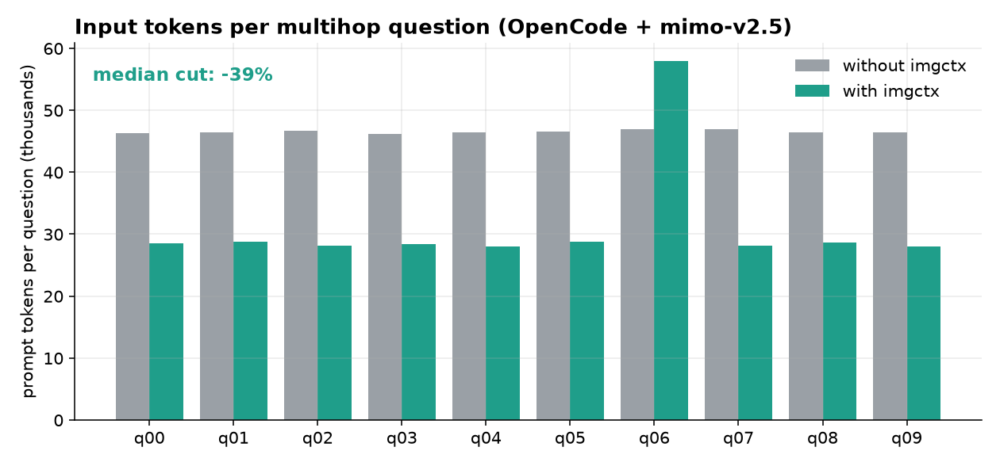
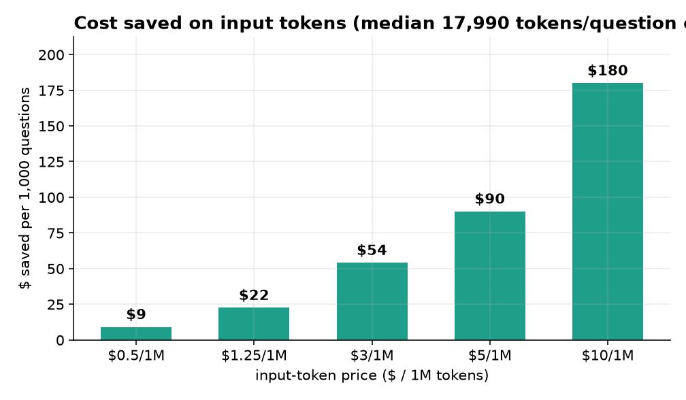
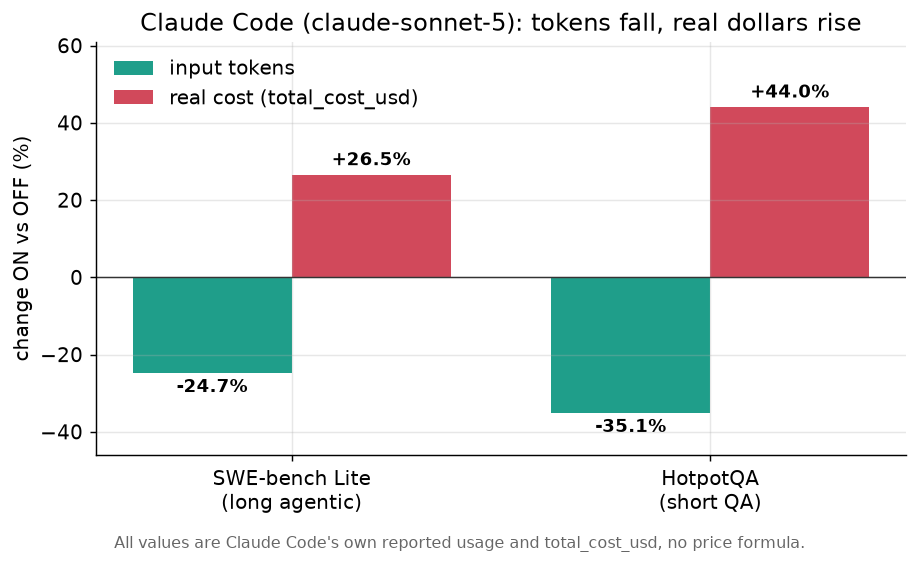
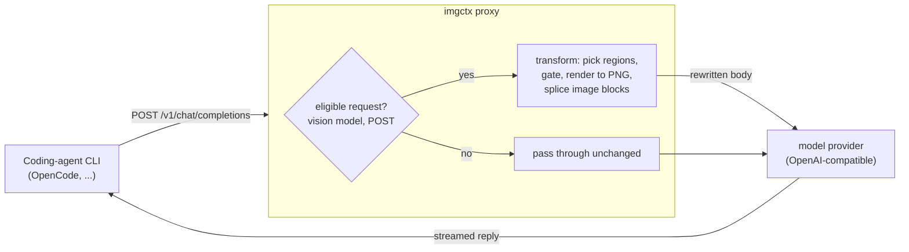

# imgctx

**A transparent proxy that renders bulky text context into images before it reaches a vision-capable LLM, cutting input tokens without changing your coding-agent CLI.**

`imgctx` sits between a coding-agent CLI and the model provider. It intercepts each request, renders the large text regions (system prompt, tool docs, tool output, old history) to compact PNG pages, and forwards them as image blocks. Tool definitions, tool-call linkage, and multi-turn structure are preserved, so the agent behaves exactly as before while sending far fewer input tokens. It speaks two request shapes: the **OpenAI-compatible** Chat Completions API (for example [OpenCode][OpenCode]) and the **native Anthropic Messages API** used by **Claude Code**.

> **imgctx has one job: send fewer input tokens. It does that on every provider.** Whether fewer tokens also means fewer dollars is a **separate, provider-specific** question, because tokens are the weight of your request and cost is what your provider charges to ship it. On most providers, and on read-once work everywhere, the token cut is a dollar cut too (measured **-13% to -18%** real cost even on Anthropic Sonnet). The **one** case where imaging can raise a bill is a provider that charges a cache-write premium (Anthropic) on a workload that re-sends the same big context every turn (a long agentic loop), where that context is already served cheaply from cache. That is a quirk of one provider's price list, not a defect, and it is handled by aiming imgctx at the right regions. Plain-language explainer: [What imgctx saves vs what depends on your provider](docs/input-tokens-vs-cost.md). Full measured breakdown: [When imaging pays](#when-imaging-pays-and-when-it-does-not).

```
your CLI  ->  imgctx proxy  ->  model provider
              (renders bulk text to images,
               streams the reply back untouched)
```

## Why it matters

An image's token cost is fixed by its pixel area, not by how many characters it contains. Dense content (code, JSON, logs, tool output) packs many characters into few image tokens. Agentic coding sessions re-send a large, mostly-static context on every step (system prompt, tool schemas, prior file reads), so that context dominates the token count. Rendering it to images cuts that token count with no change to the CLI and no model fine-tuning.

Whether the token cut becomes a **dollar** cut depends on how many times that big context is read. When it is a unique input read once (long-document QA, summarization, extraction), the provider must pay full price to *store* it (a cache-write, ~1.25x to 2x the input rate), so shrinking it to image tokens cuts dollars too, measured **-13% to -18%** in real cost on Anthropic Sonnet. When it is a prefix re-read every turn of a long agentic loop, that text is already served from cache at ~0.1x, so imaging busts that warm cache into fresh writes and can cost more. The deciding class is the cache-write, and both directions are quantified in [When imaging pays](#when-imaging-pays-and-when-it-does-not).

## Results

Measured end-to-end on **HotpotQA** multihop questions driven through the **real OpenCode CLI** (`opencode run`, model `mimo-v2.5-free`). Same questions run twice, once with `imgctx` and once in pure passthrough, logged by the same proxy.



| metric                             | without imgctx | with imgctx |           change |
| ---------------------------------- | -------------: | ----------: | ---------------: |
| median input tokens / question     |         46,454 |      28,464 | **-38.7%** |
| matched-trajectory subset (9/10 q) |        418,307 |     255,498 | **-38.9%** |
| exact match                        |           7/10 |        7/10 |                0 |
| answer-contains-gold               |           7/10 |        8/10 |               +1 |

Accuracy holds (no exact-match loss) on a hard multihop set with a small, free 9B-class reader.

### Isolated compression (single request)

To isolate the compression from agent nondeterminism, the same payload is sent once as text and once imaged (`python -m bench.ab`), and the provider-billed `prompt_tokens` compared. A needle is embedded in each payload to confirm the model still reads it.

| payload      | text tokens | imaged tokens |           change | needle recalled |
| ------------ | ----------: | ------------: | ---------------: | :-------------: |
| dense code   |      18,138 |         5,288 | **-70.8%** |       yes       |
| 51 KB JSON   |      24,565 |         5,477 | **-77.7%** |       yes       |
| sparse prose |       3,615 |         2,159 |           -40.3% |       yes       |

On a real captured OpenCode request (system prompt + 34 tool schemas + a file-read result), the residual text that stays as tokens drops from **123,656 to 15,097 characters (-87.8%)**, with all 34 tools preserved and tool calling intact.

### Bounding agent loops

Agentic runs sometimes loop (the model re-reads and retries), and each looped step re-sends the accumulating imaged context, which could cost more end-to-end. `imgctx` freezes old, settled turns into byte-identical images the provider caches (it reports `cached_tokens` on them), so looped sessions stay bounded. In the run above, the end-to-end input-token total across every call was **-32.6%** versus passthrough, and the one question that did loop stayed cheap because its old turns were served from cache. Agent looping is nondeterministic and n is small, so treat the end-to-end figure as indicative; the mechanism (byte-stable, cacheable history images) is verified separately.

### Dollar cost

`mimo-v2.5-free` is free, so the saving is measured in tokens. Applied to a paid model's input-token price, the median cut of **17,990 input tokens per question** is worth:



| input price ($ / 1M tokens) | saved per 1,000 questions |
| --------------------------- | ------------------------: |
| $0.50                       | $9                        |
| $1.25                       | $22                       |
| $3.00                       | $54                       |
| $5.00                       | $90                       |
| $10.00                      | $180                      |

This counts input tokens only. Some providers bill image inputs on a separate schedule; on `mimo` the image cost is folded into `prompt_tokens`, so the measured token figure already includes it. Reproduce every number with `python -m bench.hotpot_experiment --n 10 && python -m bench.make_report && python docs/make_charts.py`.

#### Cache split and simulated cost (all four benchmarks)

The zen/`mimo` endpoint reports its own cache detail (`prompt_tokens_details.cached_tokens` and `cache_write_tokens`). Running the SAME four benchmarks as the Anthropic study through OpenCode/`mimo-v2.5-free` (matched OFF vs ON) shows the structural reason the OpenCode path is a clean win in every regime, including the two that LOST money on Anthropic:

| benchmark | task shape | input tokens Δ | cache-write tokens | simulated cost Δ |
| --- | --- | ---: | ---: | ---: |
| SWE-bench Lite (n=4) | re-read, agentic | **-53.8%** | **0** | **-49.5%** |
| HotpotQA (n=10) | re-read, short | **-32.9%** | **0** | **-32.1%** |
| narrativeqa (n=6) | read once | **-27.1%** | **0** | **-35.0%** |
| gov_report (n=4) | read once | **-39.4%** | **0** | **-41.6%** |

**`cache_write_tokens` is 0 on every call, both arms, in all four benchmarks: this endpoint bills no cache-write premium.** That is the whole difference from Anthropic, where the 2x cache-write class is what imaging inflated and what raised the bill on the re-read tasks. With no such class here, the input-token cut flows straight to the bill in every regime, so SWE-bench and HotpotQA (which cost **+26.5%** and **+44.0%** on Anthropic) now show a cost *cut* on OpenCode.

**On the dollar figures: `mimo-v2.5-free` is $0.00 in reality, so there is no real cost to report.** The percentages above are a clearly-labelled SIMULATION under a representative OpenAI-style rate table (fresh 1x, cache-write no premium, cache-read 0.5x), shown only to reveal the shape of the bill; the token and cache-split numbers are real. Full per-class tables, the rate table, and the honest caveat about output/loop variance: [OpenCode cost breakdown](bench/OPENCODE_COST_BREAKDOWN.md). Reproduce with `python -m bench.longdoc_opencode_experiment --n 6 --config narrativeqa`, `... --n 4 --config gov_report`, `python -m bench.swebench_opencode_experiment --n 5`, then `python -m bench.opencode_cost_breakdown`.

## When imaging pays (and when it does not)

Imaging always cuts **tokens**. Whether it also cuts **dollars** comes down to a single question about your task: **is the big context a reusable prefix the model re-reads many times, or a unique payload it reads once?** Get that right and `imgctx` cuts both tokens and cost, even on a caching provider like Anthropic. The measured proof is below.

> **In one minute (the whole thing, simply).** Think of the provider's prompt cache as a **library**: shelving a new page (a *cache-write*) is the priciest thing you can do (~2x), borrowing an already-shelved page (a *cache-read*) is the cheapest (~0.1x), a **20x gap**. imgctx renders text to an image, which is always **new bytes**, so it always costs a shelving (write). That write is a **waste** when it replaces something already on the shelf (a fixed prefix the model re-reads, so imaging it turns cheap borrows into pricey re-shelving, bill goes **up**), and a **saving** when it is just a thinner version of a page you had to shelve anyway (a unique document read once, bill goes **down**). "Fewer tokens" and "fewer dollars" disagree precisely because of that 20x read-vs-write gap. **The one rule: image content that is unique and read once; leave the re-read prefix as text.**
>
> Want the full, from-zero explanation with every benchmark number, the per-call cache traces, and a proof the A/B is not contaminated by shared cache? See **[Understanding Tokens, Prompt Caching, and Cost](docs/understanding-tokens-cache-cost.md)**.

### The one idea to understand: prompt caching

Some providers keep a **prompt cache**. The first time they see a chunk of text they charge a one-time *write* price to store it; every later request that repeats that chunk is served from cache at a steep discount (a *read*). On Anthropic, a cache-read costs about **0.1x** the normal input rate, a cache-write costs about **1.25x to 2x**, and a first-time chunk with no reuse is plain input at **1x**.

That cache is what decides the outcome, so the whole question is: **how many times does the model re-read your big context?**

### The losing shape: a big context re-read every turn, ON A WRITE-PREMIUM PROVIDER

This shape only loses on a provider that charges a **cache-write premium**, which today means Anthropic. Long agentic coding loops are its ideal case: the same system prompt, tool schemas, and growing history repeat on every turn, so after turn one the provider serves almost all of it at the ~0.1x **read** rate. Here is the trap, step by step:

1. **Without `imgctx`**, that repeated context is text the provider has already cached. You pay the cheap **read** price (~0.1x) for it every turn.
2. **With `imgctx`**, the same context is now an **image**: far fewer tokens, but brand-new bytes the provider has never seen, so it is billed as a **write** (~1.25x to 2x) and cannot reuse the text cache.
3. You traded a large number of **very cheap** tokens for a small number of **expensive** tokens. The token count drops, the price-per-token rises more, and the bill goes up.

On this shape, on Anthropic, `imgctx` is competing against a price (0.1x) it cannot beat. **But this is a property of the 2x write premium, not of the re-read shape itself.** Run the exact same re-read tasks through the OpenCode/`mimo-v2.5-free` endpoint, which reports `cache_write_tokens = 0` (no write premium), and they cut cost instead: SWE-bench **-49.5%** and HotpotQA **-32.1%** simulated cost, versus **+26.5%** and **+44.0%** on Anthropic. Same imgctx, same tasks, opposite sign, decided entirely by whether the provider charges for the write. Full four-benchmark table: [Cache split and simulated cost](#cache-split-and-simulated-cost-all-four-benchmarks).

### The winning shape: a big UNIQUE context read once

Now flip it. Many real jobs send one large, unique document and read it a single time: long-document QA, summarization, classification, one-pass extraction, a big log or transcript you paste once. The document is brand-new, so **both** arms must cache-**write** it on first sight (you cannot cache-read something the provider has never seen). There is no warm cache for `imgctx` to bust, it just makes that unavoidable write **smaller**: fewer image tokens to store than the raw text. And the cache-write is the single most expensive input class (~1.25x to 2x), so shrinking it is exactly where the dollars are. This wins on a short trajectory, where the one-time write is a large slice of the bill and is not yet amortized away by many cheap re-reads (which is what saves the re-read shape and sinks imaging there).

### Measured, both shapes, same model, same tool

Measured through the **real Claude Code CLI** (`claude -p`, model `claude-sonnet-5`), each task run twice (compression OFF passthrough vs ON). **Dollars are Claude Code's own reported `total_cost_usd`**, not a price formula, and tokens are Claude's own reported usage:



| benchmark                                   | task shape          | input tokens | real cost (`total_cost_usd`) |
| ------------------------------------------- | ------------------- | -----------: | ---------------------------: |
| SWE-bench Lite (long agentic, n=5)          | re-read prefix      | **-24.7%**   | **+26.5%**                   |
| HotpotQA (short read-a-doc QA, n=5)         | re-read prefix      | **-35.1%**   | **+44.0%**                   |
| LongBench narrativeqa (unique doc, n=6)     | read once           | **-14.6%**   | **-17.6%**                   |
| LongBench gov_report (unique report, n=4)   | read once           | **-13.2%**   | **-14.8%**                   |

Same provider, same model, opposite dollar sign. The blended "input tokens" number actually understates the effect, because ~90% of that volume is cheap 0.1x cache-reads. The real lever is the **cache-write** class, and the whole result reduces to its direction:

| benchmark        | task shape     | cache-WRITE tokens | real cost |
| ---------------- | -------------- | -----------------: | --------: |
| SWE-bench Lite   | re-read prefix | **+87.6%**         | +26.5%    |
| HotpotQA         | re-read prefix | **+80.2%**         | +44.0%    |
| narrativeqa      | read once      | **-27.2%**         | -17.6%    |
| gov_report       | read once      | **-26.4%**         | -14.8%    |

Cache-write and real cost move the same direction every time. On the re-read tasks imaging busts the warm text-cache that OFF reads at 0.1x, forcing new writes (+80% to +88%), so the bill rises even though total tokens fall. On the read-once tasks it shrinks the one write both arms must pay (-27%), so the bill falls. Fresh 1x input is ~0% in all four (Claude Code caches almost everything), so it is not the lever, the write is. Every run stayed correct: answer quality (F1 / summary) held within noise of the OFF baseline, 0 tool-call errors, 0 HTTP 400s. The economics flip with the task, the behavior does not.

### So how should you use it

Point `imgctx` at unique, read-once bulk, and leave it off where a cheap cache is already doing the saving for you:

| Use it here (cuts tokens **and** cost) | Skip it here (a write-premium cache already wins) |
| --- | --- |
| **Read-once large inputs** on any provider: long-document QA, summarization, classification, one-pass extraction, a big log/transcript pasted once. Measured on Anthropic Sonnet: **-13% to -18% real dollars** (LongBench). Nothing is cached to undercut, so the token cut is a straight dollar cut, and it can keep you **under the context-window limit** when the raw text would not fit. | **Re-read prefixes on a write-premium caching provider** (Anthropic / Claude Code long agentic loops). The repeated context is already ~0.1x; imaging turns cheap reads into pricier writes (measured **+26% to +44%**). This is the ONLY skip case, and it is specific to the 2x write premium. |
| **Any regime on a provider with no cache-write premium** (OpenCode/`mimo`, OpenAI-style caching): read-once AND re-read both win, because there is no write class to inflate. Measured across all four benchmarks on OpenCode: **-27% to -54%** input tokens, cost falling with them, including the re-read tasks that lost on Anthropic. | Cache-cheap models on repetitive turns where a write premium applies, which also add a small image "read tax" on top of losing the cache discount. |
| **Cheap-vision** models, where image tokens are priced low relative to text. | Short chat-style turns where the context is small to begin with; there is little to compress and the gate skips it anyway. |

**Rule of thumb:** first ask *"does my provider charge a cache-write premium?"* If **no** (OpenCode/`mimo`, OpenAI-style caching), imgctx cuts both tokens and cost in every regime, just turn it on. If **yes** (Anthropic), then ask *"is the big context read once, or re-read every turn?"* **Read once** (unique document, summarize, classify, extract) is a win on both tokens and dollars even there. **Re-read** every turn is the one case that already sits at ~0.1x, so use `imgctx` only for the token-count / context-window benefit, or leave it off (`IMGCTX_ENABLED=0`). Either way you are never worse off than an informed choice, because both arms are measurable from your provider's own reported cost.

This is why `imgctx` is best thought of as a **targeting tool, not an always-on switch**: it turns bulky text into cheap image tokens, a clear win exactly when that text is not already cheap. Reproduce the read-once win with `python -m bench.longdoc_experiment --n 6 --config narrativeqa --model sonnet && python -m bench.longdoc_report`, and the re-read numbers with `python -m bench.swebench_experiment --n 5 --model sonnet` and `python -m bench.hotpot_claude_experiment --n 5 --model sonnet`, then `python docs/make_anthropic_chart.py`.

**Go deeper:** [Understanding Tokens, Prompt Caching, and Cost](docs/understanding-tokens-cache-cost.md) explains all of this from zero, with the full per-token-class tables for every benchmark, the exact dollar decomposition (which reconciles to Claude's real bill to the cent), a call-by-call trace of why imaging re-shelves the warm cache, and a timeline proof that the ON vs OFF comparison is not contaminated by shared cache.

## Demo

```console
$ imgctx serve
imgctx v0.1.0 proxy on http://127.0.0.1:8787
  -> upstream https://opencode.ai/zen/v1

# point OpenCode's provider at the proxy (examples/opencode.json), then:
$ opencode run --model opencode/mimo-v2.5-free \
    "read documents.md and answer: were Scott Derrickson and Ed Wood the same nationality?"
> Read documents.md
yes

# same question, measured by the proxy:
#   without imgctx : 46,283 input tokens
#   with imgctx    : 28,552 input tokens   (-38%, same answer)
```

## Architecture



The proxy only rewrites the request body. The response is streamed back byte-for-byte. Any parse error, unknown shape, or unsupported model falls through as a plain passthrough.

## How it works

Each request is split into regions, and each region is compressed only when it pays off:

1. **System prompt** and **tool documentation** are rendered to images. Tool schemas in `tools[]` are kept as JSON but stripped to their structure (names, parameter types, `required`, `enum`), so the provider can still validate tool calls while the verbose descriptions move into pixels.
2. **Tool outputs** (file reads, command output) and **older user messages** are imaged in place; the live (most recent) user turn always stays as text for full fidelity.
3. **Old conversation history** is collapsed: the settled, closed prefix (never cutting between a tool call and its result) is frozen into byte-identical image chunks that the provider caches, while the recent tail stays as text.

Two guards keep it safe and profitable:

- **Profitability gate.** Image-token cost is proportional to pixel area. A block is imaged only when its estimated image cost is below its text-token cost, and only above a per-region size floor, so sparse or tiny blocks stay text.
- **Verbatim safety.** Vision models read rendered text as embeddings, not OCR, so exact strings (hashes, UUIDs, secrets) can fail silently. `imgctx` keeps identifier-dense and secret-bearing blocks as text, and for any block it does image, it extracts the exact tokens (paths, hashes, versions, numbers, flags) and carries them alongside the image as plain text.

Rendering is deterministic: the same text always produces the same PNG bytes, which is what lets frozen history images hit the provider's automatic prompt cache turn after turn.

## Quick start

Requirements: Python 3.10+, `poppler-utils` (`pdftoppm`) on `PATH`, and an OpenAI-compatible upstream with a multimodal model.

```bash
git clone https://github.com/NatBrian/image-token-compression
cd image-token-compression
pip install -e .
imgctx serve            # proxy on http://127.0.0.1:8787
```

### Use it in a coding-agent CLI

Point the CLI's provider base URL at the proxy. For OpenCode (`~/.config/opencode/opencode.json`, see `examples/opencode.json`):

```json
{
  "$schema": "https://opencode.ai/config.json",
  "provider": {
    "opencode": { "options": { "baseURL": "http://127.0.0.1:8787/v1" } }
  }
}
```

Then use OpenCode as usual:

```bash
opencode run --model opencode/mimo-v2.5-free "read src/app.py and explain what it does"
imgctx stats            # summarize tokens saved from ~/.imgctx/events.jsonl
```

Any OpenAI-compatible CLI works the same way: set its base URL to `http://127.0.0.1:8787/v1` and set `IMGCTX_UPSTREAM_BASE` to the real endpoint.

### Use it with Claude Code

`imgctx` also speaks the native Anthropic Messages API, so Claude Code can route through it. Point Claude Code's base URL at the proxy:

```bash
ANTHROPIC_BASE_URL=http://127.0.0.1:8787 claude -p "fix the failing test in src/app.py"
```

The proxy forwards to `https://api.anthropic.com` and, for subscription auth, injects the OAuth token from `~/.claude/.credentials.json` (Claude Code strips its own credential from non-canonical hosts). For coding agents, keep the **system prompt as text** (`IMGCTX_SYSTEM=0`): it carries exact cwd/tool-use rules and is already cache-read cheaply, so imaging it is low-reward and can mis-orient the agent.

**Match it to the job (see [When imaging pays](#when-imaging-pays-and-when-it-does-not)):** on Anthropic it cuts real dollars for **read-once** work (long-document QA, summarization, extraction: measured **-13% to -18%**), but can raise cost on **re-read** long agentic loops where the context is already cache-read cheaply. Both arms are measurable from Claude Code's own `total_cost_usd`, so measure before committing.

### Configuration

All settings are environment variables:

| variable                                                                                                   | default                              | meaning                                             |
| ---------------------------------------------------------------------------------------------------------- | ------------------------------------ | --------------------------------------------------- |
| `IMGCTX_PORT`                                                                                            | `8787`                             | proxy port                                          |
| `IMGCTX_UPSTREAM_BASE`                                                                                   | `https://opencode.ai/zen/v1`       | real upstream (OpenAI-compatible)                   |
| `IMGCTX_MODELS`                                                                                          | `mimo,gemini,gpt-4,gpt-5,qwen,glm` | vision allowlist (substring match);`off` disables |
| `IMGCTX_TOOLS` / `IMGCTX_SYSTEM` / `IMGCTX_TOOL_RESULTS` / `IMGCTX_USER_TEXT` / `IMGCTX_HISTORY` | on                                   | per-region toggles                                  |
| `IMGCTX_MIN_TOOL_RESULT_CHARS` / `IMGCTX_MIN_USER_TEXT_CHARS`                                          | `6000`                             | per-region size floor                               |
| `IMGCTX_MIN_SYSTEM_CHARS` / `IMGCTX_MIN_TOTAL_CHARS`                                                   | `2000`                             | slab and whole-request floors                       |
| `IMGCTX_DPI`                                                                                             | `96`                               | render DPI (lower = denser, higher = more legible)  |
| `IMGCTX_MAX_PIXELS`                                                                                      | `1000000`                          | per-image pixel cap (avoid provider downscaling)    |
| `IMGCTX_KEEP_SHARP` / `IMGCTX_FACTSHEET`                                                               | on                                   | verbatim-safety features                            |
| `IMGCTX_ENABLED`                                                                                         | on                                   | master switch (`0` = pure passthrough)            |

## Known limitations

- **The token cut is guaranteed; the dollar cut is provider-specific.** imgctx always reduces input tokens (that is the product, and it holds on every provider). Turning that into a lower bill depends on your provider's price list, not on imgctx. On providers with no cache-write premium (OpenAI, no-cache upstreams) and on read-once work everywhere, fewer tokens is fewer dollars (measured **-13% to -18%** on Anthropic Sonnet for read-once, and **-33% to -47%** on the no-cache OpenCode path). The single exception is **Anthropic-style caching on a re-send-heavy workload**: when a big prefix is re-read every turn of a long agentic loop, Anthropic already serves it at ~0.1x, so imaging trades cheap cache-reads for pricier cache-writes and can raise the bill even as tokens fall (measured **+26% to +44%**). That is one provider's pricing choosing the outcome, not a bug; the fix is *targeting* the right regions, not a code change. See [What imgctx saves vs what depends on your provider](docs/input-tokens-vs-cost.md), the use-it-here/skip-it-here guide in [When imaging pays](#when-imaging-pays-and-when-it-does-not), or the from-zero deep dive: [Understanding Tokens, Prompt Caching, and Cost](docs/understanding-tokens-cache-cost.md).
- **Lossy for exact strings inside images.** Byte-exact recall (hashes, UUIDs, secrets) is unreliable and fails silently. Mitigated (kept as text plus a factsheet), not eliminated. Byte-critical content should stay text.
- **Reader-model dependent.** Comprehension varies by model; keep the allowlist to models you have validated. Weaker readers can lose some accuracy on hard tasks.
- **Latency.** Rendering adds time to large requests before they leave, and vision encoding adds server-side time.
- **Wins on dense content.** Sparse prose has little to gain; the gate skips content where imaging would cost more than it saves.
- **Agent-loop variance.** History collapse bounds looped-session cost, but agent looping is nondeterministic and not fully eliminated.

## Inspired by

- *Text or Pixels? It Takes Half: On the Token Efficiency of Visual Text Inputs in Multimodal LLMs* ([arXiv:2510.18279](https://arxiv.org/abs/2510.18279))
- *LensVLM: Selective Context Expansion for Compressed Visual Representation of Text* ([arXiv:2605.07019](https://arxiv.org/abs/2605.07019))

`imgctx` is an independent implementation of the render-text-as-image idea, built as a transparent proxy for coding-agent CLIs.

## License

MIT, see [LICENSE](LICENSE).

[OpenCode]: https://opencode.ai
