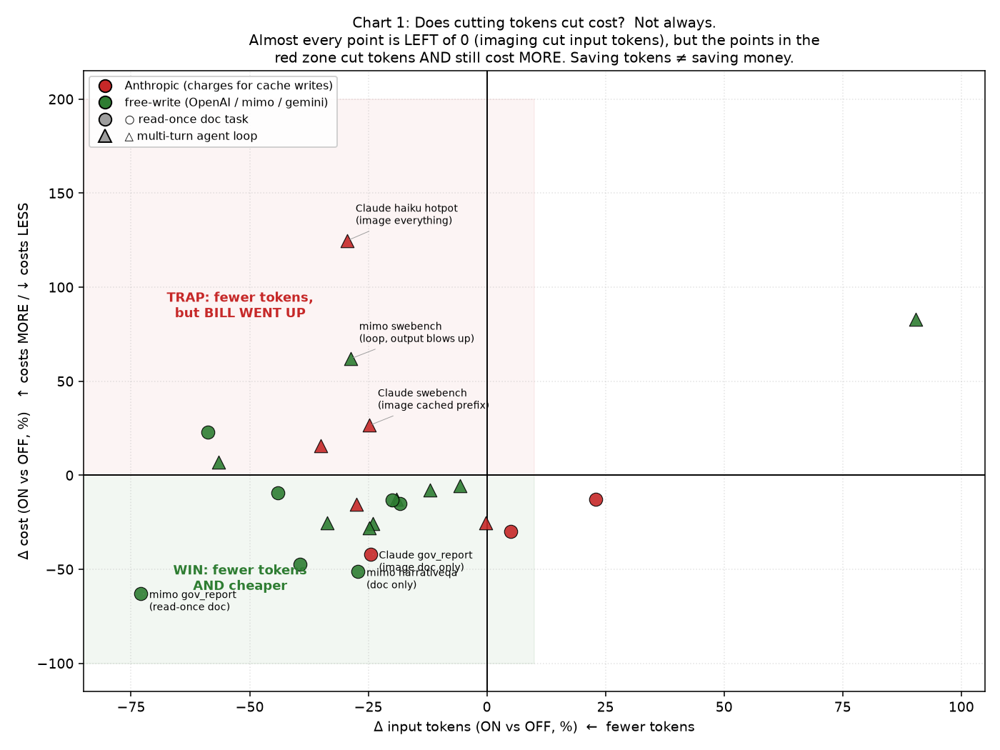
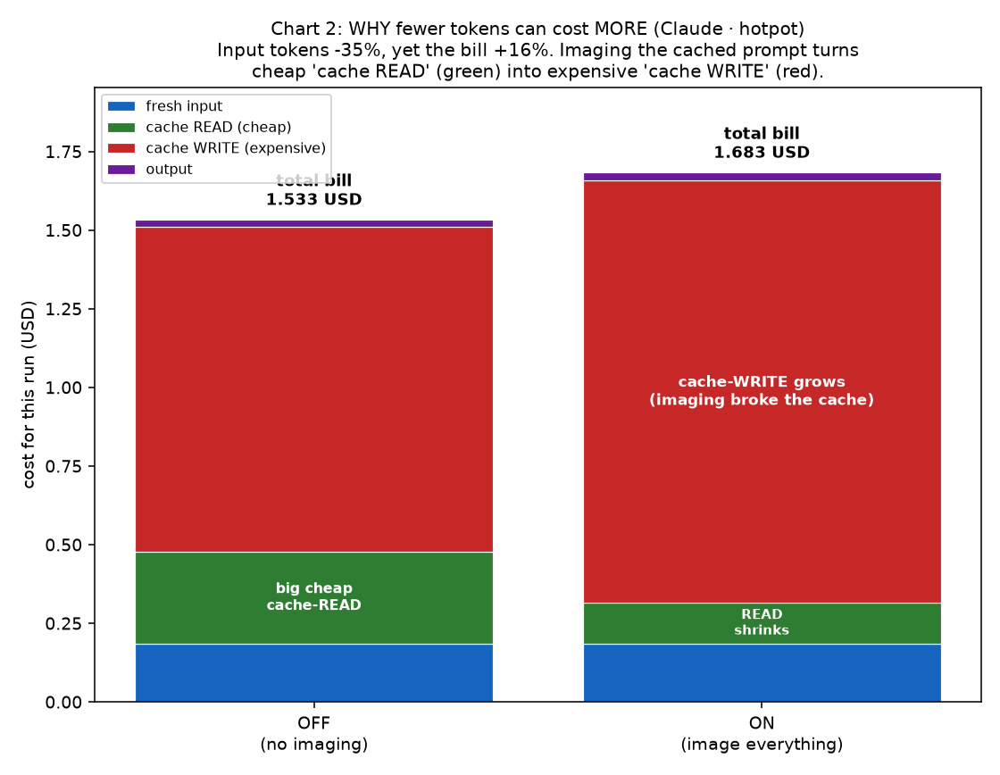
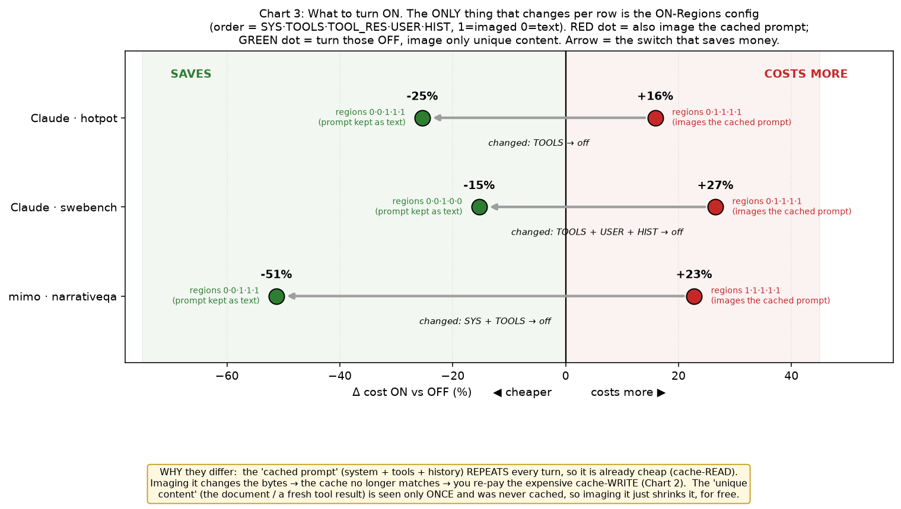

# FINAL benchmark report: grouped by Bench, CLI, Model, ON-regions

_24 groups from 40 runs (excluded 10 by request, dropped 2 empty/failed). Nothing rerun; costs & tokens from captured results, claude image counts from the events backfill sidecar._

**Dropped as empty/failed (no usable tokens):** `longdoc_opencode_runs_gemini_31_flash_lite/_gov_report`, `longdoc_opencode_runs_gemini_31_flash_lite/_narrativeqa`

# What this benchmark is, in plain words

If you are seeing this repository for the first time, read this section before the numbers.
It explains what is being measured, what the results mean, and, just as important, what they
do not mean.

## What imgctx is

imgctx is a transparent proxy that sits between a coding agent (a command-line AI assistant)
and the model provider. Large language models charge by the token, and a long text prompt is
many tokens. imgctx takes bulky pieces of that text prompt and renders them into images
before the request is sent. A picture of text is usually far cheaper in tokens than the same
text spelled out, so the request that reaches the provider is smaller. If imgctx cannot do
this safely for a request, it passes the request through unchanged, so turning it on should
never break a run.

## What this benchmark measures, and why

The goal is to answer one honest question: does turning imgctx on actually save money, or
does it only save tokens? Those are not the same thing. Tokens are the size of your request;
cost is what the provider charges to serve it, and providers price different kinds of tokens
very differently.

To find out, each test runs the exact same task twice, once with imgctx OFF and once with it
ON, and compares the token usage and the cost. Everything else is held the same. The tests
span several different situations so the answer is not accidental:

- Different task shapes. Some tasks read one big document a single time and answer (document
  question-answering and summarization). Others are agent loops that keep re-sending a
  growing context every step (multi-hop reasoning and real code-fixing).
- Different coding agents. The same idea is tried through more than one command-line agent,
  because each one packages its prompt differently.
- Different model providers. Providers fall into pricing families that treat cached text
  very differently, and that turns out to decide the whole outcome.
- Different imgctx settings. imgctx can image different regions of the prompt (the system
  instructions, the tool definitions, tool outputs, the user's text, and the prior
  conversation). Which regions you image changes the result, so the tests vary that too.

## What we found, in words

- Turning imgctx on reliably makes the request smaller. Fewer input tokens is the dependable,
  repeatable effect.
- Smaller is not always cheaper. Whether fewer tokens becomes fewer dollars depends on the
  provider's price list and on the shape of the task.
- Imaging a big piece of content that is only sent once (a document, or a fresh chunk of tool
  output) is the safe, broad win. It shrinks something you were going to pay full price for
  anyway.
- Imaging text that the provider was already serving cheaply from its cache can backfire. On
  providers that charge extra to refresh the cache, re-imaging that repeated text can cost
  more than it saves, even though the token count went down.
- A few models react to imaging by writing longer answers or taking more steps. Since output
  is the most expensive kind of token everywhere, that extra output can eat the savings.
- Answer quality held up. Where the tasks are scored, correctness with imgctx on stayed in
  the same range as with it off, and failures did not increase.

The short version: imgctx saves tokens almost everywhere, and it saves money when its
settings are matched to the provider and the task. The guide and tables below show exactly
how to make that match.

## Known limitations, stated plainly

This is engineering evidence, not a peer-reviewed study. Please read it that way.

- Small samples. Each measured cell is a handful of items, not hundreds. The direction of an
  effect is trustworthy; the exact size of a percentage is not, and would move with more data.
- Simulated versus real cost. Only one of the agents here bills a real invoice we can read.
  The others run on free or subscription tiers, so their cost is a simulation computed from
  published list prices. Those figures are clearly labelled as simulated and exist to show
  the shape of the bill, not to quote an exact charge.
- Prices drift. The rate tables reflect public list prices at the time of testing. Providers
  change prices, so re-check them before trusting a dollar figure.
- A couple of noisy runs. In one case a provider became unstable mid-run, and in another the
  imaging step did not actually fire. These are flagged in the report rather than removed, so
  you can see them and discount them yourself.
- Some image counts cannot be attributed. For part of the older Claude data, several runs
  shared one image log, so their counts got mixed together and cannot be split apart. Those
  cells honestly show "n/a" instead of a guessed number.
- Not perfectly reproducible. Real agents make slightly different choices each time they run,
  so no two runs are identical to the token. The comparison that matters is OFF versus ON
  under the same setup, not one run reproduced exactly.

## How to run it yourself

The raw measurements are stored as results files under the per-benchmark folders in `bench/`
(the bulky per-item artifacts are kept out of version control; the aggregated results are
archived in `bench_data.tar.gz`). From the repository root:

- Regenerate this report: `python -m bench.generate_final_report`
- Regenerate the charts: `python -m bench.make_final_charts`
- Rebuild the Claude image-count sidecar (optional): `python -m bench.backfill_images`

Each benchmark has its own driver script under `bench/` (their file names end in
`_experiment.py`). Every driver runs the OFF arm and the ON arm back to back and writes a
results file; the header comment in each driver documents its exact settings.

## How to read the rest of this report

1. The guide directly below explains the pricing mechanism (cache reads versus cache writes)
   and gives a per-provider recipe for which regions to image.
2. The Summary groups every run by benchmark, agent, model, and imgctx region setting. Each
   delta compares ON against OFF and is only comparable to other rows with the same region
   setting.
3. The charts turn the three questions a reader usually has into pictures.
4. Detailed Runs expands every group with the full token breakdown, both cost bases, and a
   per-item table, so nothing is hidden.

---

# imgctx cost & token guide (the pricing mechanism)

Why imgctx always cuts tokens but sometimes RAISES the bill, and how to configure it per
provider. No prior knowledge of "cache read/write" assumed. Every claim is grounded in the
measured groups further down this report.

## 1. One-paragraph summary

imgctx renders bulky **text** context into **images** before sending to the model. Fewer
text tokens means fewer INPUT tokens. Nearly every measured run cut input tokens. But the
**bill is not the token count**; it is tokens × the *price* of each token, and images change
*which price bucket* a token falls into. On some providers that re-pricing costs more than
the tokens saved. So: **imgctx always saves tokens; it saves MONEY only when its config
matches the provider's pricing and the task shape.**

## 2. Cache 101: when "cache write" and "cache read" happen

A coding agent re-sends almost the SAME giant prompt every step (system instructions, the
tool list, files it already read, the conversation so far). Providers avoid charging full
price for that repetition with a **prompt cache**:

- **Cache WRITE:** the FIRST time a chunk of text is seen, the provider stores it. You pay
  a one-time *write* price.
- **Cache READ:** every LATER step that re-sends the *identical* chunk reuses the stored
  copy. You pay a much cheaper *read* price.
- **The catch:** the cache matches on EXACT bytes. Change one byte and it is a brand-new
  chunk (a new WRITE, not a READ).

Analogy: print a document once (write), then photocopy it cheaply many times (read). Edit
the document and you must print again.

## 3. Why imgctx can INCREASE cost while cutting tokens

An image is *different bytes* than the text it replaced, so imaging a chunk **breaks its
cache match**: text that would have been a cheap repeated **cache READ** comes back as a
fresh/**cache WRITE**. Whether that helps depends entirely on the read-vs-write price gap
for your provider (section 4).

Measured proof:
- **Claude Code · haiku · hotpot** (everything imaged): input **-29.4%**, real cost
  **+124.8%**. Tokens fell, yet the bill more than doubled, because cheap cache-reads became
  expensive cache-writes.
- **Claude Code · sonnet · hotpot**: image everything (`0·1·1·1·1`) gives real cost **+15.9%**;
  image almost nothing (`0·0·1·1·1`) gives real cost **-25.4%**. Same model, same task; only
  the regions differ, and the *sign of the bill flips*.

## 4. The root cause: two provider pricing families

Everything follows from ONE table (USD per 1,000,000 tokens; from this report's rate table):

| provider | fresh input | cache WRITE | cache READ | output |
|---|--:|--:|--:|--:|
| **Anthropic** (Claude Code) sonnet | 3.00 | **3.75** | **0.30** | 15.00 |
| Anthropic haiku | 1.00 | 1.25 | 0.10 | 5.00 |
| **OpenAI** (Codex / OpenCode-gpt) | 0.75 | **0.00** | 0.075 | 4.50 |
| **mimo** (OpenCode free tier) | 0.14 | **0.00** | 0.003 | 0.28 |
| gemini flash-lite | 0.10 | 0.00 | 0.025 | 0.40 |

Two families explain every result:

- **Write-premium family = Anthropic.** A cache WRITE (3.75) costs MORE than fresh input
  (3.00) and **12.5× a cache READ** (0.30). Re-imaging already-cached text is the single
  most expensive mistake here (that is the haiku +124.8% above).
- **Free-write family = OpenAI / mimo / gemini.** Cache WRITE is **0.00**. Breaking the
  cache costs nothing extra, so imaging to cut tokens is nearly always safe on cost.

One more lever: **output** is the priciest bucket everywhere, and on **mimo output is 93×
its cache-read** (0.28 vs 0.003). If imaging makes the model TALK MORE (longer answers, more
retries), mimo's bill can rise even when input tokens crash (section 6).

## 5. The ON Regions: what each images and its cost effect

imgctx chooses, region by region, which text becomes images. A config is written
`SYS·TOOLS·TOOL_RES·USER·HIST` (1 = imaged, 0 = left as text).

| Region | What it is | Normally cached? | Image it? |
|---|---|---|---|
| **SYS** (system) | Fixed system prompt | Yes, identical every turn, so cache READ after turn 1 | **Rarely.** Imaging a stable cached prefix turns cheap reads into writes. On Anthropic this only adds cost. Keep **0**. |
| **TOOLS** | Tool / function schemas | Yes, fixed prefix, cached | **Rarely**, same reason as SYS. Keep **0** on Anthropic. |
| **TOOL_RES** (tool results) | Outputs of tool calls: file reads, search dumps | Usually **no**, large and UNIQUE, seen once | **Yes, the sweet spot.** Big, fresh, not a repeat read, so imaging shrinks real tokens with no cache penalty. |
| **USER** (user text) | The user's message text | Depends | **Only if large** (e.g. a pasted document). Small prompts: no benefit. |
| **HIST** (history) | Prior turns re-sent each step | Yes on loops, mostly cache READ | **Avoid on loops.** History grows and is re-imaged every turn, which on Anthropic re-writes cache and on mimo inflates output. **0** for loops; **1** is fine for one-shot doc tasks. |

HIST proof, Claude Code · narrativeqa, identical except history:
- `0·0·1·1·0` (history kept as text): real cost **-29.9%**.
- `0·0·1·1·1` (history imaged): real cost only **-12.7%**.
Imaging history more than halved the saving.

## 6. Task SHAPE: read-once vs loop

- **Read-once tasks** (gov_report summary, easy narrativeqa): one big UNIQUE document read a
  single time. Imaging it shrinks the one-time cost everyone pays → **wins on every
  provider.** mimo gov_report all-regions: input **-72.9%**, cost **-62.9%**; Claude
  gov_report doc-only: real cost **-41.9%**.
- **Loop tasks** (swebench code-fix, hotpot multi-hop, hard narrativeqa): the same growing
  context is re-sent every turn and is mostly warm cache. Imaging it busts that cache (bad
  on Anthropic) and can make mimo emit more output (bad on mimo). mimo swebench all-regions:
  input **-56.5%** but cost **+7.1%**; mimo narrativeqa all-regions: input **-58.8%** but
  cost **+22.7%**. Switching mimo narrativeqa to doc-only `0·0·1·1·1` → cost **-51.2%**.

## 7. Decision guide: what to turn on

### Provider CHARGES for cache writes (Anthropic / Claude Code)
Image only big, unique, read-once content; never the cached prefix or loop history.
- Start at `0·0·1·1·0` (image TOOL_RES + USER text; history as text).
- Add HIST=1 (`0·0·1·1·1`) ONLY for single-shot document tasks (gov_report **-41.9%**).
- Never SYS=1 or TOOLS=1 here; that is the **+15.9%** (hotpot) / **+26.5%** (swebench)
  all-regions mistake.
- Expect: read-once tasks **-15% to -42%**; pure agent loops best left near OFF or
  TOOL_RES-only.

### Provider does NOT charge for cache writes (Codex, OpenCode-gpt, gemini, mimo)
Breaking cache is free, so image aggressively for the biggest token cut, with ONE mimo caveat.
- Default all regions on (`1·1·1·1·1`). Codex: **-25% to -28%** simulated cost across tasks.
- **mimo caveat:** on LOOP tasks, all-regions can raise cost via output growth (swebench
  **+7.1%**, narrativeqa **+22.7%**). Use doc-only `0·0·1·1·1` for mimo loops
  (narrativeqa **-51.2%**); keep all-regions for mimo read-once docs (gov_report **-62.9%**).

### Quick lookup
| Provider family | Read-once doc task | Agent loop task |
|---|---|---|
| Anthropic (write premium) | `0·0·1·1·1` (doc + history) | `0·0·1·0·0` / near-OFF (only fresh tool results) |
| OpenAI / gemini (free write) | `1·1·1·1·1` | `1·1·1·1·1` |
| mimo (free write, pricey output) | `1·1·1·1·1` | `0·0·1·1·1` (doc-only; avoid output blow-up) |

## 8. What to trust / caveats

- **Tokens ≠ money.** Input-token cuts are real and near-universal; make COST the decision
  metric, not tokens.
- **Real vs simulated cost.** Only Claude Code reports a real provider bill (`Δ Real Cost`).
  Codex/OpenCode run on subscription/free tiers, so their cost is SIMULATED from the section-4
  rate table (`Δ Sim Cost`), clearly labelled.
- **Small samples.** Each group is 2 to 4 items. Directions are consistent and
  mechanism-explained, but exact percentages will move with more data.
- **Two noisy cells, flagged not hidden.** `OpenCode gemini swebench` shows +90% tokens (a
  degenerate run under provider instability); `OpenCode gpt-5.4-mini gov_report` shows -44%
  tokens with **0 images** (imaging did not fire, so the change is agent-trajectory noise, not
  imgctx). Do not read these as imgctx effects.
- **Quality held.** F1 / answer-contains stayed within noise of OFF and error counts did not
  rise, in the groups that carry scores.
- **Why some claude "Avg Imgs/call" cells show `n/a`.** Claude's usage report omits how many
  images imgctx made, so we recover the count from imgctx's own image log. Older runs wrote
  that log as a single shared file per ON/OFF arm and appended to it, so when several
  different runs shared one file their image counts mixed together and cannot be separated.
  Those cells show `n/a` instead of a guess; cells with a number had exactly one run writing
  their log. codex / OpenCode always show a number (their count is stored per item).

---

# Rate tables used for SIMULATED cost (USD / 1M tokens)

| model class | fresh | cache-write | cache-read | output | source |
|---|--:|--:|--:|--:|---|
| anthropic_sonnet | 3.0 | 3.75 | 0.3 | 15.0 | Anthropic claude-sonnet list |
| anthropic_haiku | 1.0 | 1.25 | 0.1 | 5.0 | Anthropic claude-haiku list |
| openai_gpt54mini | 0.75 | 0.0 | 0.075 | 4.5 | OpenAI gpt-5.4-mini list |
| openai_gpt4omini | 0.15 | 0.0 | 0.075 | 0.6 | OpenAI gpt-4o-mini list |
| mimo | 0.14 | 0.0 | 0.003 | 0.28 | Xiaomi MiMo-V2.5 first-party list |
| gemini_flash_lite | 0.1 | 0.0 | 0.025 | 0.4 | Gemini 3.1 flash-lite approx list |

# Summary: grouped runs

ON Region = imgctx config as **SYS·TOOLS·TOOL_RES·USER·HIST** (1=imaged, 0=kept as text). Δ = ON vs OFF. All Token = input+output. Avg Imgs/call = ON-arm images per model call. Deltas only comparable within the same ON-region string.

**Why some claude rows show `n/a` for Avg Imgs/call:** Claude's own usage report does not say how many images imgctx made, so we read the count from imgctx's own image log. Each run writes that log as one file per ON/OFF arm, and older runs appended to the same file, so when several different runs (different model, task, or region setting) shared one file, their image counts got mixed together and can no longer be split back apart. Rather than guess, those rows show `n/a`. Rows with a number were the only run writing to their log, so the count is exact. codex / OpenCode rows always have a number because their image count is stored per item in the results file.

| CLI Agent | Model Name | Bench | ON Region | Δ Input Token | Δ All Token | Δ Sim Cost | Δ Real Cost | Avg Imgs/call |
|---|---|---|:--:|--:|--:|--:|--:|--:|
| Claude Code | claude-haiku | hotpot | `0·1·1·1·1` | -29.4% | -29.2% | +124.8% | +124.8% | n/a |
| Claude Code | claude-sonnet | hotpot | `0·0·1·1·1` | -0.2% | -0.2% | -21.6% | -25.4% | 0.1 |
| Claude Code | claude-sonnet | hotpot | `0·1·1·1·1` | -35.1% | -35.0% | +9.8% | +15.9% | 13.0 |
| Codex | gpt-5.4-mini | hotpot | `1·1·1·1·1` | -24.1% | -24.1% | -25.6% | n/a | 1.0 |
| OpenCode | gemini-3.1-flash-lite | hotpot | `0·1·1·1·1` | -19.0% | -19.1% | -12.6% | n/a | 2.8 |
| OpenCode | gpt-5.4-mini | hotpot | `0·1·1·1·1` | -5.6% | -5.6% | -5.7% | n/a | 2.7 |
| OpenCode | mimo-v2.5-free | hotpot | `0·1·1·1·1` | -12.0% | -12.0% | -8.0% | n/a | 3.3 |
| OpenCode | mimo-v2.5-free | hotpot | `1·1·1·1·1` | -33.7% | -31.5% | -25.2% | n/a | 7.7 |
| Claude Code | claude-sonnet | swebench | `0·0·1·0·0` | -27.5% | -27.5% | -17.3% | -15.3% | 0.0 |
| Claude Code | claude-sonnet | swebench | `0·1·1·1·1` | -24.7% | -24.7% | +13.8% | +26.5% | 13.5 |
| Codex | gpt-5.4-mini | swebench | `1·1·1·1·1` | -24.8% | -25.0% | -28.1% | n/a | 1.1 |
| OpenCode | gemini-3.1-flash-lite | swebench | `0·1·1·1·1` | +90.5% | +90.3% | +83.1% | n/a | 10.1 |
| OpenCode | mimo-v2.5-free | swebench | `0·1·1·1·1` | -28.7% | -27.2% | +62.0% | n/a | 8.7 |
| OpenCode | mimo-v2.5-free | swebench | `1·1·1·1·1` | -56.5% | -56.4% | +7.1% | n/a | 11.6 |
| Claude Code | claude-sonnet | narrativeqa | `0·0·1·1·0` | +5.0% | +5.7% | -23.4% | -29.9% | 4.8 |
| Claude Code | claude-sonnet | narrativeqa | `0·0·1·1·1` | +22.9% | +23.6% | -4.9% | -12.7% | n/a |
| Codex | gpt-5.4-mini | narrativeqa | `1·1·1·1·1` | -18.2% | -18.3% | -15.1% | n/a | 1.1 |
| OpenCode | mimo-v2.5-free | narrativeqa | `0·0·1·1·1` | -27.1% | -25.6% | -51.2% | n/a | 4.0 |
| OpenCode | mimo-v2.5-free | narrativeqa | `1·1·1·1·1` | -58.8% | -44.2% | +22.7% | n/a | 9.5 |
| Claude Code | claude-sonnet | gov_report | `0·0·1·1·1` | -24.5% | -24.3% | -36.3% | -41.9% | n/a |
| Codex | gpt-5.4-mini | gov_report | `1·1·1·1·1` | -19.9% | -20.2% | -13.1% | n/a | 1.1 |
| OpenCode | gpt-5.4-mini | gov_report | `0·0·1·1·1` | -44.0% | -44.5% | -9.5% | n/a | 0.0 |
| OpenCode | mimo-v2.5-free | gov_report | `0·0·1·1·1` | -39.4% | -38.9% | -47.5% | n/a | 1.2 |
| OpenCode | mimo-v2.5-free | gov_report | `1·1·1·1·1` | -72.9% | -72.6% | -62.9% | n/a | 10.1 |

# Charts: visual summary

_Three charts, each answering one question a reader of the table above has. Generated by `python -m bench.make_final_charts` from the identical grouped numbers; regenerate after re-running this report._

### Q1: Does cutting tokens cut cost?

Each dot is one (agent · model · task · regions) group. **Left of the vertical line = imaging cut input tokens** (almost everything does). But height is what you pay: dots in the **red zone cut tokens and STILL cost more** (the trap), dots in the **green zone are the real wins** (cheaper too). Red dots = Anthropic (charges for cache writes); green dots = free-write providers. Circles are read-once document tasks, triangles are multi-turn agent loops; notice the loops cluster toward the trap. Takeaway: **saving tokens is not the same as saving money.**

### Q2: Why can the bill go UP when tokens go DOWN?

One Anthropic example (Claude · hotpot), with the bill broken into what you actually pay for. **OFF**, most of the cost is cheap repeated **cache-READ** (green). **ON**, imaging changes the bytes so that text no longer matches the cache, and it comes back as expensive **cache-WRITE** (red). Input tokens fell 35%, yet the red slice grows enough that the **total bill rises 16%**. That is the whole mechanism, in dollars.

### Q3: So what should I turn ON?

Same model and task each time. The **only** difference is the **ON-Regions config** (`SYS·TOOLS·TOOL_RES·USER·HIST`, 1=imaged 0=text), printed on each dot. The arrow names exactly which regions were switched off: Claude hotpot `0·1·1·1·1`→`0·0·1·1·1` (TOOLS off), Claude swebench `0·1·1·1·1`→`0·0·1·0·0` (TOOLS+USER+HIST off), mimo narrativeqa `1·1·1·1·1`→`0·0·1·1·1` (SYS+TOOLS off). Follow each arrow from the red dot (costlier) to the green dot (cheaper):

- **Red = image the cached prompt** (system + tools + history). That block repeats every turn, so it is already cheap (**cache-READ**). Imaging it changes the bytes, the cache stops matching, and you re-pay the expensive **cache-WRITE**, so the bill goes UP.
- **Green = image only the unique content** (the document / a fresh tool result). It is seen once and was never cached, so imaging it just shrinks it, and the bill goes DOWN.

The rule: **image the big one-time content; leave the repeated prompt as text.** (Per-provider recipe in section 7 of the guide above.)

# Detailed Runs

## ▶ Benchmark: hotpot

### Claude Code · claude-haiku · ON regions `0·1·1·1·1`
regions: SYS=0 · TOOLS=1 · TOOL_RES=1 · USER=1 · HIST=1 · sim-rate _Anthropic claude-haiku list_ · merged from 1 run folder(s)

| metric | OFF | ON | Δ |
|---|---:|---:|---:|
| items | 5 | 5 | +0.0% |
| errors | 0 | 0 | n/a |
| input total | 448,040 | 316,220 | -29.4% |
| · fresh | 90 | 90 | +0.0% |
| · cache-read | 382,896 | 93,965 | -75.5% |
| · cache-write | 65,054 | 222,165 | +241.5% |
| output | 3,044 | 3,208 | +5.4% |
| all tokens (in+out) | 451,084 | 319,428 | -29.2% |
| avg calls/turns | 2.0 | 2.0 | +0.0% |
| ON images (sum) | n/a | n/a | shown as n/a because this group's image log file was shared with other runs (different model / task / region), so the images are mixed together and cannot be split back out; we show n/a instead of guessing |
| **cost SIMULATED** | `0.1349` | `0.3032` | +124.8% |
| **cost REAL** | `0.1349` | `0.3032` | +124.8% |
| F1 (avg) | 0.848 | 0.860 | +1.5% |
| contains (avg) | 0.800 | 1.000 | n/a |
| avg duration s | 13 | 32 | +142.6% |

per-item detail

| run folder | item | cond | fresh | c-read | c-write | out | imgs | sim USD | real USD | score |
|---|---|---|--:|--:|--:|--:|--:|--:|--:|--:|
| hotpot_claude_runs | q00 | off | 18 | 76,572 | 12,876 | 322 | n/a | `0.0254` | `0.0254` | f1=1.00 |
| hotpot_claude_runs | q00 | on | 18 | 18,793 | 44,493 | 331 | n/a | `0.0592` | `0.0592` | f1=1.00 |
| hotpot_claude_runs | q01 | off | 18 | 76,581 | 13,058 | 849 | n/a | `0.0282` | `0.0282` | f1=0.67 |
| hotpot_claude_runs | q01 | on | 18 | 18,793 | 44,599 | 688 | n/a | `0.0611` | `0.0611` | f1=0.30 |
| hotpot_claude_runs | q02 | off | 18 | 76,588 | 13,278 | 561 | n/a | `0.0271` | `0.0271` | f1=1.00 |
| hotpot_claude_runs | q02 | on | 18 | 18,793 | 44,108 | 1,096 | n/a | `0.0625` | `0.0625` | f1=1.00 |
| hotpot_claude_runs | q03 | off | 18 | 76,578 | 12,742 | 493 | n/a | `0.0261` | `0.0261` | f1=1.00 |
| hotpot_claude_runs | q03 | on | 18 | 18,793 | 44,356 | 449 | n/a | `0.0596` | `0.0596` | f1=1.00 |
| hotpot_claude_runs | q04 | off | 18 | 76,577 | 13,100 | 819 | n/a | `0.0281` | `0.0281` | f1=0.57 |
| hotpot_claude_runs | q04 | on | 18 | 18,793 | 44,609 | 644 | n/a | `0.0609` | `0.0609` | f1=1.00 |

### Claude Code · claude-sonnet · ON regions `0·0·1·1·1`
regions: SYS=0 · TOOLS=0 · TOOL_RES=1 · USER=1 · HIST=1 · sim-rate _Anthropic claude-sonnet list_ · merged from 1 run folder(s)

| metric | OFF | ON | Δ |
|---|---:|---:|---:|
| items | 5 | 5 | +0.0% |
| errors | 0 | 0 | n/a |
| input total | 591,677 | 590,283 | -0.2% |
| · fresh | 28,150 | 28,150 | +0.0% |
| · cache-read | 434,855 | 477,985 | +9.9% |
| · cache-write | 128,672 | 84,148 | -34.6% |
| output | 771 | 815 | +5.7% |
| all tokens (in+out) | 592,448 | 591,098 | -0.2% |
| avg calls/turns | 2.0 | 2.0 | +0.0% |
| ON images (sum) | n/a | 1 | counted from imgctx's own image log (this group was the only writer) |
| ON avg img/call | n/a | 0.10 | over 10 imaging calls |
| **cost SIMULATED** | `0.7090` | `0.5556` | -21.6% |
| **cost REAL** | `0.9985` | `0.7450` | -25.4% |
| F1 (avg) | 0.848 | 0.848 | +0.0% |
| contains (avg) | 0.800 | 0.800 | n/a |
| avg duration s | 11 | 11 | -4.4% |

per-item detail

| run folder | item | cond | fresh | c-read | c-write | out | imgs | sim USD | real USD | score |
|---|---|---|--:|--:|--:|--:|--:|--:|--:|--:|
| hotpot_claude_runs | q00 | off | 5,630 | 52,459 | 60,136 | 132 | n/a | `0.2601` | `0.3954` | f1=1.00 |
| hotpot_claude_runs | q00 | on | 5,630 | 95,589 | 17,042 | 143 | n/a | `0.1116` | `0.1500` | f1=1.00 |
| hotpot_claude_runs | q01 | off | 5,630 | 95,598 | 17,004 | 183 | n/a | `0.1121` | `0.1503` | f1=0.67 |
| hotpot_claude_runs | q01 | on | 5,630 | 95,598 | 17,059 | 186 | n/a | `0.1123` | `0.1507` | f1=0.67 |
| hotpot_claude_runs | q02 | off | 5,630 | 95,607 | 17,522 | 127 | n/a | `0.1132` | `0.1526` | f1=1.00 |
| hotpot_claude_runs | q02 | on | 5,630 | 95,607 | 16,035 | 202 | n/a | `0.1087` | `0.1448` | f1=1.00 |
| hotpot_claude_runs | q03 | off | 5,630 | 95,598 | 16,801 | 162 | n/a | `0.1110` | `0.1488` | f1=1.00 |
| hotpot_claude_runs | q03 | on | 5,630 | 95,598 | 16,804 | 157 | n/a | `0.1109` | `0.1487` | f1=1.00 |
| hotpot_claude_runs | q04 | off | 5,630 | 95,593 | 17,209 | 167 | n/a | `0.1126` | `0.1513` | f1=0.57 |
| hotpot_claude_runs | q04 | on | 5,630 | 95,593 | 17,208 | 127 | n/a | `0.1120` | `0.1507` | f1=0.57 |

### Claude Code · claude-sonnet · ON regions `0·1·1·1·1`
regions: SYS=0 · TOOLS=1 · TOOL_RES=1 · USER=1 · HIST=1 · sim-rate _Anthropic claude-sonnet list_ · merged from 2 run folder(s)

| metric | OFF | ON | Δ |
|---|---:|---:|---:|
| items | 11 | 11 | +0.0% |
| errors | 0 | 0 | n/a |
| input total | 1,304,806 | 847,305 | -35.1% |
| · fresh | 61,930 | 61,930 | +0.0% |
| · cache-read | 966,933 | 427,028 | -55.8% |
| · cache-write | 275,943 | 358,347 | +29.9% |
| output | 1,501 | 1,681 | +12.0% |
| all tokens (in+out) | 1,306,307 | 848,986 | -35.0% |
| avg calls/turns | 2.0 | 2.0 | +0.0% |
| ON images (sum) | n/a | 26 | counted from this group's own image log only; 1 other log(s) were shared with different runs and left out, so this is a floor |
| ON avg img/call | n/a | 13.00 | over 2 imaging calls |
| **cost SIMULATED** | `1.5332` | `1.6829` | +9.8% |
| **cost REAL** | `1.3908` | `1.6114` | +15.9% |
| F1 (avg) | 0.861 | 0.787 | -8.6% |
| contains (avg) | 0.818 | 0.818 | n/a |
| avg duration s | 9 | 28 | +209.7% |

per-item detail

| run folder | item | cond | fresh | c-read | c-write | out | imgs | sim USD | real USD | score |
|---|---|---|--:|--:|--:|--:|--:|--:|--:|--:|
| hotpot_claude_runs | q00 | off | 5,630 | 95,696 | 17,128 | 123 | n/a | `0.1117` | `0.1502` | f1=1.00 |
| hotpot_claude_runs | q00 | on | 5,630 | 40,309 | 31,220 | 122 | n/a | `0.1479` | `0.2181` | f1=1.00 |
| hotpot_claude_runs | q01 | off | 5,630 | 95,705 | 17,106 | 176 | n/a | `0.1124` | `0.1509` | f1=0.67 |
| hotpot_claude_runs | q01 | on | 5,630 | 40,318 | 31,222 | 173 | n/a | `0.1487` | `0.2189` | f1=0.67 |
| hotpot_claude_runs | q02 | off | 5,630 | 95,714 | 17,632 | 130 | n/a | `0.1137` | `0.1533` | f1=1.00 |
| hotpot_claude_runs | q02 | on | 5,630 | 40,327 | 30,224 | 196 | n/a | `0.1453` | `0.2133` | f1=1.00 |
| hotpot_claude_runs | q03 | off | 5,630 | 95,705 | 16,905 | 155 | n/a | `0.1113` | `0.1494` | f1=1.00 |
| hotpot_claude_runs | q03 | on | 5,630 | 40,318 | 31,019 | 169 | n/a | `0.1478` | `0.2176` | f1=0.18 |
| hotpot_claude_runs | q04 | off | 5,630 | 95,700 | 17,307 | 119 | n/a | `0.1123` | `0.1512` | f1=0.57 |
| hotpot_claude_runs | q04 | on | 5,630 | 40,313 | 31,402 | 147 | n/a | `0.1489` | `0.2196` | f1=0.57 |
| hotpot_claude_runs | q00 | off | 5,630 | 52,560 | 60,227 | 122 | n/a | `0.2603` | `0.0868` | f1=1.00 |
| hotpot_claude_runs | q00 | on | 5,630 | 31,913 | 39,584 | 126 | n/a | `0.1768` | `0.0589` | f1=1.00 |
| hotpot_claude_runs | q01 | off | 5,630 | 95,687 | 17,098 | 171 | n/a | `0.1123` | `0.0374` | f1=0.67 |
| hotpot_claude_runs | q01 | on | 5,630 | 40,300 | 31,179 | 124 | n/a | `0.1478` | `0.0493` | f1=0.67 |
| hotpot_claude_runs | q02 | off | 5,630 | 95,696 | 17,590 | 106 | n/a | `0.1132` | `0.0377` | f1=1.00 |
| hotpot_claude_runs | q02 | on | 5,630 | 40,309 | 30,207 | 182 | n/a | `0.1450` | `0.0483` | f1=1.00 |
| hotpot_claude_runs | q03 | off | 5,630 | 95,687 | 16,889 | 154 | n/a | `0.1112` | `0.0371` | f1=1.00 |
| hotpot_claude_runs | q03 | on | 5,630 | 40,300 | 30,979 | 154 | n/a | `0.1475` | `0.0492` | f1=1.00 |
| hotpot_claude_runs | q04 | off | 5,630 | 95,682 | 17,288 | 118 | n/a | `0.1122` | `0.0374` | f1=0.57 |
| hotpot_claude_runs | q04 | on | 5,630 | 40,295 | 31,313 | 151 | n/a | `0.1487` | `0.0496` | f1=0.57 |
| hotpot_verify_runs/claude_sonnet | q00 | off | 5,630 | 53,101 | 60,773 | 127 | n/a | `0.2626` | `0.3994` | f1=1.00 |
| hotpot_verify_runs/claude_sonnet | q00 | on | 5,630 | 32,326 | 39,998 | 137 | n/a | `0.1786` | `0.2686` | f1=1.00 |

### Codex · gpt-5.4-mini · ON regions `1·1·1·1·1`
regions: SYS=1 · TOOLS=1 · TOOL_RES=1 · USER=1 · HIST=1 · sim-rate _OpenAI gpt-5.4-mini list_ · merged from 3 run folder(s)

| metric | OFF | ON | Δ |
|---|---:|---:|---:|
| items | 5 | 5 | +0.0% |
| errors | 0 | 0 | n/a |
| input total | 187,727 | 142,483 | -24.1% |
| · fresh | 39,631 | 28,947 | -27.0% |
| · cache-read | 148,096 | 113,536 | -23.3% |
| · cache-write | 0 | 0 | n/a |
| output | 3,834 | 2,884 | -24.8% |
| all tokens (in+out) | 191,561 | 145,367 | -24.1% |
| avg calls/turns | 7.4 | 7.0 | -5.4% |
| ON images (sum) | n/a | 34 | counted per item from results.json |
| ON avg img/call | n/a | 0.97 | over 35 imaging calls |
| **cost SIMULATED** | `0.0581` | `0.0432` | -25.6% |
| **cost REAL** | n/a | n/a | n/a |
| F1 (avg) | 0.867 | 0.600 | -30.8% |
| contains (avg) | 1.000 | 0.600 | n/a |
| avg duration s | 23 | 25 | +10.3% |

per-item detail

| run folder | item | cond | fresh | c-read | c-write | out | imgs | sim USD | real USD | score |
|---|---|---|--:|--:|--:|--:|--:|--:|--:|--:|
| campaign_20260710_180022/codex_hotpot | q00 | off | 5,884 | 32,768 | 0 | 679 | 0 | `0.0099` | n/a | f1=1.00 |
| campaign_20260710_180022/codex_hotpot | q00 | on | 4,896 | 20,096 | 0 | 520 | 6 | `0.0075` | n/a | f1=1.00 |
| campaign_20260710_180022/codex_hotpot | q01 | off | 10,229 | 23,168 | 0 | 1,075 | 0 | `0.0142` | n/a | f1=0.67 |
| campaign_20260710_180022/codex_hotpot | q01 | on | 6,226 | 36,224 | 0 | 651 | 10 | `0.0103` | n/a | f1=0.00 |
| campaign_dryrun_20260710_152928/codex_hotpot | q00 | off | 6,129 | 32,768 | 0 | 792 | 0 | `0.0106` | n/a | f1=1.00 |
| campaign_dryrun_20260710_152928/codex_hotpot | q00 | on | 4,990 | 20,096 | 0 | 459 | 6 | `0.0073` | n/a | f1=1.00 |
| campaign_dryrun_20260710_152928/codex_hotpot | q01 | off | 6,210 | 32,256 | 0 | 599 | 0 | `0.0098` | n/a | f1=0.67 |
| campaign_dryrun_20260710_152928/codex_hotpot | q01 | on | 8,099 | 17,024 | 0 | 641 | 6 | `0.0102` | n/a | f1=0.00 |
| hotpot_verify_runs/codex | q00 | off | 11,179 | 27,136 | 0 | 689 | 0 | `0.0135` | n/a | f1=1.00 |
| hotpot_verify_runs/codex | q00 | on | 4,736 | 20,096 | 0 | 613 | 6 | `0.0078` | n/a | f1=1.00 |

### OpenCode · gemini-3.1-flash-lite · ON regions `0·1·1·1·1`
regions: SYS=0 · TOOLS=1 · TOOL_RES=1 · USER=1 · HIST=1 · sim-rate _Gemini 3.1 flash-lite approx list_ · merged from 1 run folder(s)

| metric | OFF | ON | Δ |
|---|---:|---:|---:|
| items | 3 | 3 | +0.0% |
| errors | 0 | 0 | n/a |
| input total | 162,261 | 131,392 | -19.0% |
| · fresh | 146,002 | 131,392 | -10.0% |
| · cache-read | 16,259 | 0 | -100.0% |
| · cache-write | 0 | 0 | n/a |
| output | 328 | 213 | -35.1% |
| all tokens (in+out) | 162,589 | 131,605 | -19.1% |
| avg calls/turns | 3.3 | 3.0 | -10.0% |
| ON images (sum) | n/a | 25 | counted per item from results.json |
| ON avg img/call | n/a | 2.78 | over 9 imaging calls |
| **cost SIMULATED** | `0.0151` | `0.0132` | -12.6% |
| **cost REAL** | n/a | n/a | n/a |
| F1 (avg) | 0.767 | 0.667 | -13.0% |
| contains (avg) | 1.000 | 0.667 | n/a |
| avg duration s | 12 | 32 | +173.7% |

per-item detail

| run folder | item | cond | fresh | c-read | c-write | out | imgs | sim USD | real USD | score |
|---|---|---|--:|--:|--:|--:|--:|--:|--:|--:|
| hotpot_opencode_runs_gemini_31_flash_lite_v2 | q00 | off | 45,605 | 0 | 0 | 110 | 0 | `0.0046` | n/a | f1=1.00 |
| hotpot_opencode_runs_gemini_31_flash_lite_v2 | q00 | on | 43,754 | 0 | 0 | 72 | 8 | `0.0044` | n/a | f1=1.00 |
| hotpot_opencode_runs_gemini_31_flash_lite_v2 | q01 | off | 54,423 | 16,259 | 0 | 145 | 0 | `0.0059` | n/a | f1=0.30 |
| hotpot_opencode_runs_gemini_31_flash_lite_v2 | q01 | on | 43,924 | 0 | 0 | 69 | 8 | `0.0044` | n/a | f1=0.00 |
| hotpot_opencode_runs_gemini_31_flash_lite_v2 | q02 | off | 45,974 | 0 | 0 | 73 | 0 | `0.0046` | n/a | f1=1.00 |
| hotpot_opencode_runs_gemini_31_flash_lite_v2 | q02 | on | 43,714 | 0 | 0 | 72 | 9 | `0.0044` | n/a | f1=1.00 |

### OpenCode · gpt-5.4-mini · ON regions `0·1·1·1·1`
regions: SYS=0 · TOOLS=1 · TOOL_RES=1 · USER=1 · HIST=1 · sim-rate _OpenAI gpt-5.4-mini list_ · merged from 1 run folder(s)

| metric | OFF | ON | Δ |
|---|---:|---:|---:|
| items | 1 | 1 | +0.0% |
| errors | 0 | 0 | n/a |
| input total | 37,304 | 35,217 | -5.6% |
| · fresh | 37,304 | 35,217 | -5.6% |
| · cache-read | 0 | 0 | n/a |
| · cache-write | 0 | 0 | n/a |
| output | 153 | 139 | -9.2% |
| all tokens (in+out) | 37,457 | 35,356 | -5.6% |
| avg calls/turns | 3.0 | 3.0 | +0.0% |
| ON images (sum) | n/a | 8 | counted per item from results.json |
| ON avg img/call | n/a | 2.67 | over 3 imaging calls |
| **cost SIMULATED** | `0.0287` | `0.0270` | -5.7% |
| **cost REAL** | n/a | n/a | n/a |
| F1 (avg) | 1.000 | 1.000 | +0.0% |
| contains (avg) | 1.000 | 1.000 | n/a |
| avg duration s | 9 | 15 | +57.0% |

per-item detail

| run folder | item | cond | fresh | c-read | c-write | out | imgs | sim USD | real USD | score |
|---|---|---|--:|--:|--:|--:|--:|--:|--:|--:|
| hotpot_verify_runs/opencode_oauth | q00 | off | 37,304 | 0 | 0 | 153 | 0 | `0.0287` | n/a | f1=1.00 |
| hotpot_verify_runs/opencode_oauth | q00 | on | 35,217 | 0 | 0 | 139 | 8 | `0.0270` | n/a | f1=1.00 |

### OpenCode · mimo-v2.5-free · ON regions `0·1·1·1·1`
regions: SYS=0 · TOOLS=1 · TOOL_RES=1 · USER=1 · HIST=1 · sim-rate _Xiaomi MiMo-V2.5 first-party list_ · merged from 1 run folder(s)

| metric | OFF | ON | Δ |
|---|---:|---:|---:|
| items | 1 | 1 | +0.0% |
| errors | 0 | 0 | n/a |
| input total | 46,879 | 41,231 | -12.0% |
| · fresh | 23,199 | 21,391 | -7.8% |
| · cache-read | 23,680 | 19,840 | -16.2% |
| · cache-write | 0 | 0 | n/a |
| output | 160 | 145 | -9.4% |
| all tokens (in+out) | 47,039 | 41,376 | -12.0% |
| avg calls/turns | 3.0 | 3.0 | +0.0% |
| ON images (sum) | n/a | 10 | counted per item from results.json |
| ON avg img/call | n/a | 3.33 | over 3 imaging calls |
| **cost SIMULATED** | `0.0034` | `0.0031` | -8.0% |
| **cost REAL** | n/a | n/a | n/a |
| F1 (avg) | 1.000 | 1.000 | +0.0% |
| contains (avg) | 1.000 | 1.000 | n/a |
| avg duration s | 11 | 18 | +60.7% |

per-item detail

| run folder | item | cond | fresh | c-read | c-write | out | imgs | sim USD | real USD | score |
|---|---|---|--:|--:|--:|--:|--:|--:|--:|--:|
| hotpot_verify_runs/opencode_mimo | q00 | off | 23,199 | 23,680 | 0 | 160 | 0 | `0.0034` | n/a | f1=1.00 |
| hotpot_verify_runs/opencode_mimo | q00 | on | 21,391 | 19,840 | 0 | 145 | 10 | `0.0031` | n/a | f1=1.00 |

### OpenCode · mimo-v2.5-free · ON regions `1·1·1·1·1`
regions: SYS=1 · TOOLS=1 · TOOL_RES=1 · USER=1 · HIST=1 · sim-rate _Xiaomi MiMo-V2.5 first-party list_ · merged from 3 run folder(s)

| metric | OFF | ON | Δ |
|---|---:|---:|---:|
| items | 14 | 14 | +0.0% |
| errors | 0 | 0 | n/a |
| input total | 774,410 | 513,538 | -33.7% |
| · fresh | 485,962 | 331,266 | -31.8% |
| · cache-read | 288,448 | 182,272 | -36.8% |
| · cache-write | 0 | 0 | n/a |
| output | 4,990 | 20,301 | +306.8% |
| all tokens (in+out) | 779,400 | 533,839 | -31.5% |
| avg calls/turns | 3.9 | 4.5 | +16.7% |
| ON images (sum) | n/a | 488 | counted per item from results.json |
| ON avg img/call | n/a | 7.75 | over 63 imaging calls |
| **cost SIMULATED** | `0.0703` | `0.0526` | -25.2% |
| **cost REAL** | n/a | n/a | n/a |
| F1 (avg) | 0.755 | 0.814 | +7.8% |
| contains (avg) | 0.786 | 0.857 | n/a |
| avg duration s | 28 | 79 | +184.0% |

per-item detail

| run folder | item | cond | fresh | c-read | c-write | out | imgs | sim USD | real USD | score |
|---|---|---|--:|--:|--:|--:|--:|--:|--:|--:|
| campaign_20260710_180022/mimo_hotpot | q00 | off | 3,757 | 43,136 | 0 | 130 | 0 | `0.0007` | n/a | f1=1.00 |
| campaign_20260710_180022/mimo_hotpot | q00 | on | 3,176 | 25,600 | 0 | 921 | 21 | `0.0008` | n/a | f1=1.00 |
| campaign_20260710_180022/mimo_hotpot | q01 | off | 6,265 | 67,520 | 0 | 1,030 | 0 | `0.0014` | n/a | f1=0.67 |
| campaign_20260710_180022/mimo_hotpot | q01 | on | 3,281 | 25,600 | 0 | 1,421 | 21 | `0.0009` | n/a | f1=0.30 |
| mimo_refix_20260710_160813/mimo_hotpot | q00 | off | 6,784 | 134,592 | 0 | 1,907 | 0 | `0.0019` | n/a | f1=1.00 |
| mimo_refix_20260710_160813/mimo_hotpot | q00 | on | 8,106 | 105,472 | 0 | 4,987 | 144 | `0.0028` | n/a | f1=1.00 |
| mimo_refix_20260710_160813/mimo_hotpot | q01 | off | 3,856 | 43,200 | 0 | 348 | 0 | `0.0008` | n/a | f1=0.33 |
| mimo_refix_20260710_160813/mimo_hotpot | q01 | on | 3,262 | 25,600 | 0 | 943 | 43 | `0.0008` | n/a | f1=0.30 |
| hotpot_runs | q00 | off | 46,283 | 0 | 0 | 120 | 0 | `0.0065` | n/a | f1=1.00 |
| hotpot_runs | q01 | off | 46,435 | 0 | 0 | 307 | 0 | `0.0066` | n/a | f1=0.00 |
| hotpot_runs | q02 | off | 46,666 | 0 | 0 | 181 | 0 | `0.0066` | n/a | f1=1.00 |
| hotpot_runs | q03 | off | 46,119 | 0 | 0 | 130 | 0 | `0.0065` | n/a | f1=1.00 |
| hotpot_runs | q04 | off | 46,462 | 0 | 0 | 133 | 0 | `0.0065` | n/a | f1=0.57 |
| hotpot_runs | q05 | off | 46,508 | 0 | 0 | 136 | 0 | `0.0065` | n/a | f1=1.00 |
| hotpot_runs | q06 | off | 46,993 | 0 | 0 | 213 | 0 | `0.0066` | n/a | f1=1.00 |
| hotpot_runs | q07 | off | 46,963 | 0 | 0 | 133 | 0 | `0.0066` | n/a | f1=0.00 |
| hotpot_runs | q08 | off | 46,424 | 0 | 0 | 140 | 0 | `0.0065` | n/a | f1=1.00 |
| hotpot_runs | q09 | off | 46,447 | 0 | 0 | 82 | 0 | `0.0065` | n/a | f1=1.00 |
| hotpot_runs | q00 | on | 28,552 | 0 | 0 | 957 | 23 | `0.0043` | n/a | f1=1.00 |
| hotpot_runs | q01 | on | 28,828 | 0 | 0 | 1,458 | 23 | `0.0044` | n/a | f1=0.38 |
| hotpot_runs | q02 | on | 28,105 | 0 | 0 | 1,335 | 24 | `0.0043` | n/a | f1=1.00 |
| hotpot_runs | q03 | on | 28,376 | 0 | 0 | 618 | 23 | `0.0041` | n/a | f1=1.00 |
| hotpot_runs | q04 | on | 28,002 | 0 | 0 | 1,332 | 24 | `0.0043` | n/a | f1=0.75 |
| hotpot_runs | q05 | on | 28,765 | 0 | 0 | 1,306 | 23 | `0.0044` | n/a | f1=1.00 |
| hotpot_runs | q06 | on | 57,943 | 0 | 0 | 1,557 | 48 | `0.0085` | n/a | f1=1.00 |
| hotpot_runs | q07 | on | 28,183 | 0 | 0 | 1,068 | 24 | `0.0042` | n/a | f1=0.67 |
| hotpot_runs | q08 | on | 28,638 | 0 | 0 | 630 | 23 | `0.0042` | n/a | f1=1.00 |
| hotpot_runs | q09 | on | 28,049 | 0 | 0 | 1,768 | 24 | `0.0044` | n/a | f1=1.00 |

## ▶ Benchmark: swebench

### Claude Code · claude-sonnet · ON regions `0·0·1·0·0`
regions: SYS=0 · TOOLS=0 · TOOL_RES=1 · USER=0 · HIST=0 · sim-rate _Anthropic claude-sonnet list_ · merged from 1 run folder(s)

| metric | OFF | ON | Δ |
|---|---:|---:|---:|
| items | 2 | 2 | +0.0% |
| errors | 0 | 0 | n/a |
| input total | 661,004 | 479,186 | -27.5% |
| · fresh | 11,272 | 11,266 | -0.1% |
| · cache-read | 612,295 | 432,755 | -29.3% |
| · cache-write | 37,437 | 35,165 | -6.1% |
| output | 2,180 | 1,831 | -16.0% |
| all tokens (in+out) | 663,184 | 481,017 | -27.5% |
| avg calls/turns | 5.5 | 4.0 | -27.3% |
| ON images (sum) | n/a | 0 | counted from imgctx's own image log (this group was the only writer) |
| ON avg img/call | n/a | 0.00 | over 8 imaging calls |
| **cost SIMULATED** | `0.3906` | `0.3230` | -17.3% |
| **cost REAL** | `0.4748` | `0.4021` | -15.3% |
| avg duration s | 25 | 23 | -9.5% |

per-item detail

| run folder | item | cond | fresh | c-read | c-write | out | imgs | sim USD | real USD | score |
|---|---|---|--:|--:|--:|--:|--:|--:|--:|--:|
| campaign_dryrun_20260710_152928/claude_swebench | psf__requests-1963 | off | 5,633 | 215,693 | 17,639 | 914 | n/a | `0.1615` | `0.2012` | n/a |
| campaign_dryrun_20260710_152928/claude_swebench | psf__requests-1963 | on | 5,633 | 217,156 | 17,990 | 952 | n/a | `0.1638` | `0.2043` | n/a |
| campaign_dryrun_20260710_152928/claude_swebench | pallets__flask-4045 | off | 5,639 | 396,602 | 19,798 | 1,266 | n/a | `0.2291` | `0.2737` | n/a |
| campaign_dryrun_20260710_152928/claude_swebench | pallets__flask-4045 | on | 5,633 | 215,599 | 17,175 | 879 | n/a | `0.1592` | `0.1978` | n/a |

### Claude Code · claude-sonnet · ON regions `0·1·1·1·1`
regions: SYS=0 · TOOLS=1 · TOOL_RES=1 · USER=1 · HIST=1 · sim-rate _Anthropic claude-sonnet list_ · merged from 1 run folder(s)

| metric | OFF | ON | Δ |
|---|---:|---:|---:|
| items | 5 | 5 | +0.0% |
| errors | 0 | 0 | n/a |
| input total | 1,627,877 | 1,225,093 | -24.7% |
| · fresh | 28,324 | 28,332 | +0.0% |
| · cache-read | 1,507,573 | 1,024,189 | -32.1% |
| · cache-write | 91,980 | 172,572 | +87.6% |
| output | 7,314 | 5,937 | -18.8% |
| all tokens (in+out) | 1,635,191 | 1,231,030 | -24.7% |
| avg calls/turns | 5.4 | 6.4 | +18.5% |
| ON images (sum) | n/a | 420 | counted from imgctx's own image log (this group was the only writer) |
| ON avg img/call | n/a | 13.55 | over 31 imaging calls |
| **cost SIMULATED** | `0.9919` | `1.1285` | +13.8% |
| **cost REAL** | `1.1988` | `1.5167` | +26.5% |
| avg duration s | 28 | 78 | +176.1% |

per-item detail

| run folder | item | cond | fresh | c-read | c-write | out | imgs | sim USD | real USD | score |
|---|---|---|--:|--:|--:|--:|--:|--:|--:|--:|
| swebench_claude_runs | psf__requests-1963 | off | 5,633 | 215,066 | 17,525 | 880 | n/a | `0.1603` | `0.1998` | n/a |
| swebench_claude_runs | psf__requests-1963 | on | 5,635 | 160,124 | 32,783 | 860 | n/a | `0.2008` | `0.2745` | n/a |
| swebench_claude_runs | pallets__flask-4045 | off | 5,633 | 213,195 | 16,841 | 742 | n/a | `0.1551` | `0.1930` | n/a |
| swebench_claude_runs | pallets__flask-4045 | on | 5,633 | 117,243 | 31,125 | 654 | n/a | `0.1786` | `0.2486` | n/a |
| swebench_claude_runs | pylint-dev__pylint-5 | off | 5,637 | 335,304 | 18,588 | 2,505 | n/a | `0.2248` | `0.2666` | n/a |
| swebench_claude_runs | pylint-dev__pylint-5 | on | 5,633 | 116,868 | 30,785 | 881 | n/a | `0.1806` | `0.2499` | n/a |
| swebench_claude_runs | pytest-dev__pytest-1 | off | 5,633 | 220,269 | 19,101 | 1,162 | n/a | `0.1720` | `0.2150` | n/a |
| swebench_claude_runs | pytest-dev__pytest-1 | on | 5,637 | 207,243 | 34,179 | 1,494 | n/a | `0.2297` | `0.3066` | n/a |
| swebench_claude_runs | psf__requests-2148 | off | 5,788 | 523,739 | 19,925 | 2,025 | n/a | `0.2796` | `0.3244` | n/a |
| swebench_claude_runs | psf__requests-2148 | on | 5,794 | 422,711 | 43,700 | 2,048 | n/a | `0.3388` | `0.4371` | n/a |

### Codex · gpt-5.4-mini · ON regions `1·1·1·1·1`
regions: SYS=1 · TOOLS=1 · TOOL_RES=1 · USER=1 · HIST=1 · sim-rate _OpenAI gpt-5.4-mini list_ · merged from 2 run folder(s)

| metric | OFF | ON | Δ |
|---|---:|---:|---:|
| items | 4 | 4 | +0.0% |
| errors | 0 | 0 | n/a |
| input total | 207,157 | 155,706 | -24.8% |
| · fresh | 27,445 | 19,258 | -29.8% |
| · cache-read | 179,712 | 136,448 | -24.1% |
| · cache-write | 0 | 0 | n/a |
| output | 8,613 | 6,144 | -28.7% |
| all tokens (in+out) | 215,770 | 161,850 | -25.0% |
| avg calls/turns | 8.8 | 8.2 | -5.7% |
| ON images (sum) | n/a | 36 | counted per item from results.json |
| ON avg img/call | n/a | 1.09 | over 33 imaging calls |
| **cost SIMULATED** | `0.0728` | `0.0523` | -28.1% |
| **cost REAL** | n/a | n/a | n/a |
| patches produced | 3/4 | 3/4 | n/a |
| avg duration s | 50 | 45 | -9.7% |

per-item detail

| run folder | item | cond | fresh | c-read | c-write | out | imgs | sim USD | real USD | score |
|---|---|---|--:|--:|--:|--:|--:|--:|--:|--:|
| campaign_20260710_180022/codex_swebench | psf__requests-1963 | off | 6,211 | 34,304 | 0 | 2,702 | 0 | `0.0194` | n/a | patch |
| campaign_20260710_180022/codex_swebench | psf__requests-1963 | on | 5,929 | 38,272 | 0 | 1,573 | 10 | `0.0144` | n/a | patch |
| campaign_20260710_180022/codex_swebench | pallets__flask-4045 | off | 11,034 | 43,904 | 0 | 2,141 | 0 | `0.0212` | n/a | patch |
| campaign_20260710_180022/codex_swebench | pallets__flask-4045 | on | 5,494 | 27,648 | 0 | 1,022 | 8 | `0.0108` | n/a | patch |
| campaign_dryrun_20260710_152928/codex_swebench | psf__requests-1963 | off | 7,475 | 65,152 | 0 | 2,218 | 0 | `0.0205` | n/a | patch |
| campaign_dryrun_20260710_152928/codex_swebench | psf__requests-1963 | on | 4,438 | 40,832 | 0 | 2,500 | 10 | `0.0176` | n/a | patch |
| campaign_dryrun_20260710_152928/codex_swebench | pallets__flask-4045 | off | 2,725 | 36,352 | 0 | 1,552 | 0 | `0.0118` | n/a | no-patch |
| campaign_dryrun_20260710_152928/codex_swebench | pallets__flask-4045 | on | 3,397 | 29,696 | 0 | 1,049 | 8 | `0.0095` | n/a | no-patch |

### OpenCode · gemini-3.1-flash-lite · ON regions `0·1·1·1·1`
regions: SYS=0 · TOOLS=1 · TOOL_RES=1 · USER=1 · HIST=1 · sim-rate _Gemini 3.1 flash-lite approx list_ · merged from 1 run folder(s)

| metric | OFF | ON | Δ |
|---|---:|---:|---:|
| items | 2 | 2 | +0.0% |
| errors | 0 | 1 | n/a |
| input total | 305,361 | 581,581 | +90.5% |
| · fresh | 215,809 | 390,516 | +81.0% |
| · cache-read | 89,552 | 191,065 | +113.4% |
| · cache-write | 0 | 0 | n/a |
| output | 1,053 | 1,375 | +30.6% |
| all tokens (in+out) | 306,414 | 582,956 | +90.3% |
| avg calls/turns | 6.5 | 10.5 | +61.5% |
| ON images (sum) | n/a | 213 | counted per item from results.json |
| ON avg img/call | n/a | 10.14 | over 21 imaging calls |
| **cost SIMULATED** | `0.0242` | `0.0444` | +83.1% |
| **cost REAL** | n/a | n/a | n/a |
| patches produced | 2/2 | 2/2 | n/a |
| avg duration s | 30 | 247 | +725.4% |

per-item detail

| run folder | item | cond | fresh | c-read | c-write | out | imgs | sim USD | real USD | score |
|---|---|---|--:|--:|--:|--:|--:|--:|--:|--:|
| swebench_opencode_runs_gemini_31_flash_lite | psf__requests-1963 | off | 172,866 | 28,516 | 0 | 748 | 0 | `0.0183` | n/a | patch |
| swebench_opencode_runs_gemini_31_flash_lite | psf__requests-1963 | on | 369,963 | 93,592 | 0 | 1,101 | 184 | `0.0398` | n/a | patch |
| swebench_opencode_runs_gemini_31_flash_lite | pallets__flask-4045 | off | 42,943 | 61,036 | 0 | 305 | 0 | `0.0059` | n/a | patch |
| swebench_opencode_runs_gemini_31_flash_lite | pallets__flask-4045 | on | 20,553 | 97,473 | 0 | 274 | 29 | `0.0046` | n/a | patch |

### OpenCode · mimo-v2.5-free · ON regions `0·1·1·1·1`
regions: SYS=0 · TOOLS=1 · TOOL_RES=1 · USER=1 · HIST=1 · sim-rate _Xiaomi MiMo-V2.5 first-party list_ · merged from 1 run folder(s)

| metric | OFF | ON | Δ |
|---|---:|---:|---:|
| items | 5 | 5 | +0.0% |
| errors | 0 | 1 | n/a |
| input total | 2,054,039 | 1,464,868 | -28.7% |
| · fresh | 134,679 | 245,860 | +82.6% |
| · cache-read | 1,919,360 | 1,219,008 | -36.5% |
| · cache-write | 0 | 0 | n/a |
| output | 27,902 | 51,588 | +84.9% |
| all tokens (in+out) | 2,081,941 | 1,516,456 | -27.2% |
| avg calls/turns | 15.0 | 13.4 | -10.7% |
| ON images (sum) | n/a | 585 | counted per item from results.json |
| ON avg img/call | n/a | 8.73 | over 67 imaging calls |
| **cost SIMULATED** | `0.0324` | `0.0525` | +62.0% |
| **cost REAL** | n/a | n/a | n/a |
| patches produced | 3/5 | 1/4 | n/a |
| avg duration s | 87 | 186 | +113.4% |

per-item detail

| run folder | item | cond | fresh | c-read | c-write | out | imgs | sim USD | real USD | score |
|---|---|---|--:|--:|--:|--:|--:|--:|--:|--:|
| swebench_opencode_runs | psf__requests-1963 | off | 16,928 | 298,624 | 0 | 4,350 | 0 | `0.0045` | n/a | no-patch |
| swebench_opencode_runs | psf__requests-1963 | on | 71,437 | 249,216 | 0 | 5,119 | 120 | `0.0122` | n/a | patch |
| swebench_opencode_runs | pallets__flask-4045 | off | 74,765 | 386,624 | 0 | 6,447 | 0 | `0.0134` | n/a | patch |
| swebench_opencode_runs | pallets__flask-4045 | on | 28,710 | 168,512 | 0 | 2,163 | 94 | `0.0051` | n/a | no-patch |
| swebench_opencode_runs | pylint-dev__pylint-5 | off | 12,080 | 329,856 | 0 | 6,535 | 0 | `0.0045` | n/a | patch |
| swebench_opencode_runs | pylint-dev__pylint-5 | on | 111,335 | 562,048 | 0 | 6,598 | 284 | `0.0191` | n/a | n/a |
| swebench_opencode_runs | pytest-dev__pytest-1 | off | 9,627 | 174,400 | 0 | 3,694 | 0 | `0.0029` | n/a | patch |
| swebench_opencode_runs | pytest-dev__pytest-1 | on | 6,494 | 84,288 | 0 | 2,444 | 20 | `0.0018` | n/a | no-patch |
| swebench_opencode_runs | psf__requests-2148 | off | 21,279 | 729,856 | 0 | 6,876 | 0 | `0.0071` | n/a | no-patch |
| swebench_opencode_runs | psf__requests-2148 | on | 27,884 | 154,944 | 0 | 35,264 | 67 | `0.0142` | n/a | no-patch |

### OpenCode · mimo-v2.5-free · ON regions `1·1·1·1·1`
regions: SYS=1 · TOOLS=1 · TOOL_RES=1 · USER=1 · HIST=1 · sim-rate _Xiaomi MiMo-V2.5 first-party list_ · merged from 3 run folder(s)

| metric | OFF | ON | Δ |
|---|---:|---:|---:|
| items | 6 | 6 | +0.0% |
| errors | 2 | 4 | n/a |
| input total | 3,246,160 | 1,411,830 | -56.5% |
| · fresh | 167,632 | 270,902 | +61.6% |
| · cache-read | 3,078,528 | 1,140,928 | -62.9% |
| · cache-write | 0 | 0 | n/a |
| output | 41,652 | 22,075 | -47.0% |
| all tokens (in+out) | 3,287,812 | 1,433,905 | -56.4% |
| avg calls/turns | 27.0 | 22.8 | -15.4% |
| ON images (sum) | n/a | 1,592 | counted per item from results.json |
| ON avg img/call | n/a | 11.62 | over 137 imaging calls |
| **cost SIMULATED** | `0.0444` | `0.0475` | +7.1% |
| **cost REAL** | n/a | n/a | n/a |
| patches produced | 5/5 | 4/4 | n/a |
| avg duration s | 160 | 372 | +132.1% |

per-item detail

| run folder | item | cond | fresh | c-read | c-write | out | imgs | sim USD | real USD | score |
|---|---|---|--:|--:|--:|--:|--:|--:|--:|--:|
| campaign_20260710_180022/mimo_swebench | psf__requests-1963 | off | 14,431 | 299,200 | 0 | 5,527 | 0 | `0.0045` | n/a | patch |
| campaign_20260710_180022/mimo_swebench | psf__requests-1963 | on | 8,463 | 95,232 | 0 | 1,175 | 74 | `0.0018` | n/a | patch |
| campaign_20260710_180022/mimo_swebench | pallets__flask-4045 | off | 53,684 | 1,405,440 | 0 | 15,184 | 0 | `0.0160` | n/a | patch |
| campaign_20260710_180022/mimo_swebench | pallets__flask-4045 | on | 129,043 | 422,976 | 0 | 6,507 | 490 | `0.0212` | n/a | patch |
| campaign_dryrun_20260710_152928/mimo_swebench | psf__requests-1963 | off | 4,681 | 185,216 | 0 | 4,356 | 0 | `0.0024` | n/a | patch |
| campaign_dryrun_20260710_152928/mimo_swebench | psf__requests-1963 | on | 36,531 | 155,264 | 0 | 3,830 | 235 | `0.0067` | n/a | n/a |
| campaign_dryrun_20260710_152928/mimo_swebench | pallets__flask-4045 | off | 90,866 | 1,016,512 | 0 | 15,420 | 0 | `0.0201` | n/a | patch |
| campaign_dryrun_20260710_152928/mimo_swebench | pallets__flask-4045 | on | 63,943 | 220,352 | 0 | 7,700 | 338 | `0.0118` | n/a | n/a |
| mimo_refix_20260710_160813/mimo_swebench | psf__requests-1963 | off | 3,970 | 172,160 | 0 | 1,165 | 0 | `0.0014` | n/a | n/a |
| mimo_refix_20260710_160813/mimo_swebench | psf__requests-1963 | on | 32,922 | 247,104 | 0 | 2,863 | 411 | `0.0062` | n/a | patch |
| mimo_refix_20260710_160813/mimo_swebench | pallets__flask-4045 | off | 0 | 0 | 0 | 0 | 0 | `0.0000` | n/a | patch |
| mimo_refix_20260710_160813/mimo_swebench | pallets__flask-4045 | on | 0 | 0 | 0 | 0 | 44 | `0.0000` | n/a | patch |

## ▶ Benchmark: narrativeqa

### Claude Code · claude-sonnet · ON regions `0·0·1·1·0`
regions: SYS=0 · TOOLS=0 · TOOL_RES=1 · USER=1 · HIST=0 · sim-rate _Anthropic claude-sonnet list_ · merged from 1 run folder(s)

| metric | OFF | ON | Δ |
|---|---:|---:|---:|
| items | 2 | 2 | +0.0% |
| errors | 0 | 0 | n/a |
| input total | 304,987 | 320,168 | +5.0% |
| · fresh | 11,260 | 11,262 | +0.0% |
| · cache-read | 193,320 | 252,379 | +30.5% |
| · cache-write | 100,407 | 56,527 | -43.7% |
| output | 681 | 3,016 | +342.9% |
| all tokens (in+out) | 305,668 | 323,184 | +5.7% |
| avg calls/turns | 2.0 | 2.5 | +25.0% |
| ON images (sum) | n/a | 24 | counted from this group's own image log only; 1 other log(s) were shared with different runs and left out, so this is a floor |
| ON avg img/call | n/a | 4.80 | over 5 imaging calls |
| **cost SIMULATED** | `0.4785` | `0.3667` | -23.4% |
| **cost REAL** | `0.7044` | `0.4939` | -29.9% |
| F1 (avg) | 0.186 | 0.174 | -6.2% |
| contains (avg) | 0.000 | 0.000 | n/a |
| avg duration s | 13 | 38 | +188.6% |

per-item detail

| run folder | item | cond | fresh | c-read | c-write | out | imgs | sim USD | real USD | score |
|---|---|---|--:|--:|--:|--:|--:|--:|--:|--:|
| campaign_20260710_180022/claude_longdoc | q00 | off | 5,630 | 96,656 | 50,885 | 282 | n/a | `0.2409` | `0.3554` | f1=0.21 |
| campaign_20260710_180022/claude_longdoc | q00 | on | 5,632 | 155,715 | 28,278 | 779 | n/a | `0.1813` | `0.2450` | f1=0.23 |
| campaign_20260710_180022/claude_longdoc | q01 | off | 5,630 | 96,664 | 49,522 | 399 | n/a | `0.2376` | `0.3490` | f1=0.16 |
| campaign_20260710_180022/claude_longdoc | q01 | on | 5,630 | 96,664 | 28,249 | 2,237 | n/a | `0.1854` | `0.2489` | f1=0.11 |

### Claude Code · claude-sonnet · ON regions `0·0·1·1·1`
regions: SYS=0 · TOOLS=0 · TOOL_RES=1 · USER=1 · HIST=1 · sim-rate _Anthropic claude-sonnet list_ · merged from 2 run folder(s)

| metric | OFF | ON | Δ |
|---|---:|---:|---:|
| items | 8 | 8 | +0.0% |
| errors | 0 | 0 | n/a |
| input total | 1,386,530 | 1,703,707 | +22.9% |
| · fresh | 45,050 | 45,205 | +0.3% |
| · cache-read | 1,037,509 | 1,450,069 | +39.8% |
| · cache-write | 303,971 | 208,433 | -31.4% |
| output | 3,364 | 13,639 | +305.4% |
| all tokens (in+out) | 1,389,894 | 1,717,346 | +23.6% |
| avg calls/turns | 2.6 | 3.2 | +23.8% |
| ON images (sum) | n/a | n/a | shown as n/a because this group's 2 image log files were shared with other runs (different model / task / region), so the images are mixed together and cannot be split back out; we show n/a instead of guessing |
| **cost SIMULATED** | `1.6368` | `1.5568` | -4.9% |
| **cost REAL** | `2.3207` | `2.0258` | -12.7% |
| F1 (avg) | 0.237 | 0.235 | -0.8% |
| contains (avg) | 0.125 | 0.125 | n/a |
| avg duration s | 14 | 42 | +191.9% |

per-item detail

| run folder | item | cond | fresh | c-read | c-write | out | imgs | sim USD | real USD | score |
|---|---|---|--:|--:|--:|--:|--:|--:|--:|--:|
| campaign_dryrun_20260710_152928/claude_longdoc | q00 | off | 5,634 | 171,386 | 75,715 | 672 | n/a | `0.3623` | `0.5327` | f1=0.18 |
| campaign_dryrun_20260710_152928/claude_longdoc | q00 | on | 5,793 | 701,595 | 63,068 | 8,517 | n/a | `0.5921` | `0.7340` | f1=0.12 |
| campaign_dryrun_20260710_152928/claude_longdoc | q01 | off | 5,634 | 225,228 | 9,366 | 707 | n/a | `0.1302` | `0.1513` | f1=0.11 |
| campaign_dryrun_20260710_152928/claude_longdoc | q01 | on | 5,632 | 165,909 | 8,580 | 407 | n/a | `0.1049` | `0.1243` | f1=0.19 |
| longdoc_claude_runs | q00 | off | 5,630 | 104,816 | 41,087 | 220 | n/a | `0.2057` | `0.2982` | f1=0.27 |
| longdoc_claude_runs | q00 | on | 5,630 | 104,816 | 18,350 | 468 | n/a | `0.1242` | `0.1655` | f1=0.29 |
| longdoc_claude_runs | q01 | off | 5,630 | 95,549 | 49,079 | 377 | n/a | `0.2353` | `0.3457` | f1=0.17 |
| longdoc_claude_runs | q01 | on | 5,630 | 95,549 | 27,746 | 2,627 | n/a | `0.1890` | `0.2514` | f1=0.12 |
| longdoc_claude_runs | q02 | off | 5,630 | 95,538 | 29,311 | 132 | n/a | `0.1574` | `0.2234` | f1=0.20 |
| longdoc_claude_runs | q02 | on | 5,630 | 95,538 | 20,036 | 232 | n/a | `0.1242` | `0.1692` | f1=0.20 |
| longdoc_claude_runs | q03 | off | 5,630 | 95,544 | 28,440 | 159 | n/a | `0.1546` | `0.2186` | f1=0.25 |
| longdoc_claude_runs | q03 | on | 5,630 | 95,544 | 19,999 | 301 | n/a | `0.1251` | `0.1701` | f1=0.25 |
| longdoc_claude_runs | q04 | off | 5,630 | 95,558 | 51,404 | 782 | n/a | `0.2501` | `0.3657` | f1=0.04 |
| longdoc_claude_runs | q04 | on | 5,630 | 95,558 | 27,781 | 479 | n/a | `0.1569` | `0.2194` | f1=0.04 |
| longdoc_claude_runs | q05 | off | 5,632 | 153,890 | 19,569 | 315 | n/a | `0.1412` | `0.1852` | f1=0.67 |
| longdoc_claude_runs | q05 | on | 5,630 | 95,560 | 22,873 | 608 | n/a | `0.1405` | `0.1919` | f1=0.67 |

### Codex · gpt-5.4-mini · ON regions `1·1·1·1·1`
regions: SYS=1 · TOOLS=1 · TOOL_RES=1 · USER=1 · HIST=1 · sim-rate _OpenAI gpt-5.4-mini list_ · merged from 2 run folder(s)

| metric | OFF | ON | Δ |
|---|---:|---:|---:|
| items | 4 | 4 | +0.0% |
| errors | 0 | 0 | n/a |
| input total | 217,093 | 177,489 | -18.2% |
| · fresh | 50,565 | 46,161 | -8.7% |
| · cache-read | 166,528 | 131,328 | -21.1% |
| · cache-write | 0 | 0 | n/a |
| output | 5,930 | 4,663 | -21.4% |
| all tokens (in+out) | 223,023 | 182,152 | -18.3% |
| avg calls/turns | 8.5 | 8.8 | +2.9% |
| ON images (sum) | n/a | 40 | counted per item from results.json |
| ON avg img/call | n/a | 1.14 | over 35 imaging calls |
| **cost SIMULATED** | `0.0771` | `0.0655` | -15.1% |
| **cost REAL** | n/a | n/a | n/a |
| F1 (avg) | 0.516 | 0.573 | +11.1% |
| contains (avg) | 0.000 | 0.000 | n/a |
| avg duration s | 44 | 39 | -10.0% |

per-item detail

| run folder | item | cond | fresh | c-read | c-write | out | imgs | sim USD | real USD | score |
|---|---|---|--:|--:|--:|--:|--:|--:|--:|--:|
| campaign_20260710_180022/codex_longdoc | q00 | off | 11,805 | 33,280 | 0 | 1,553 | 0 | `0.0183` | n/a | f1=0.20 |
| campaign_20260710_180022/codex_longdoc | q00 | on | 14,081 | 36,224 | 0 | 1,294 | 12 | `0.0191` | n/a | f1=0.31 |
| campaign_20260710_180022/codex_longdoc | q01 | off | 19,063 | 42,880 | 0 | 1,656 | 0 | `0.0250` | n/a | f1=0.94 |
| campaign_20260710_180022/codex_longdoc | q01 | on | 9,856 | 46,848 | 0 | 1,401 | 12 | `0.0172` | n/a | f1=0.94 |
| campaign_dryrun_20260710_152928/codex_longdoc | q00 | off | 12,465 | 54,016 | 0 | 1,539 | 0 | `0.0203` | n/a | f1=0.22 |
| campaign_dryrun_20260710_152928/codex_longdoc | q00 | on | 11,711 | 27,648 | 0 | 907 | 10 | `0.0149` | n/a | f1=0.17 |
| campaign_dryrun_20260710_152928/codex_longdoc | q01 | off | 7,232 | 36,352 | 0 | 1,182 | 0 | `0.0135` | n/a | f1=0.70 |
| campaign_dryrun_20260710_152928/codex_longdoc | q01 | on | 10,513 | 20,608 | 0 | 1,061 | 6 | `0.0142` | n/a | f1=0.88 |

### OpenCode · mimo-v2.5-free · ON regions `0·0·1·1·1`
regions: SYS=0 · TOOLS=0 · TOOL_RES=1 · USER=1 · HIST=1 · sim-rate _Xiaomi MiMo-V2.5 first-party list_ · merged from 1 run folder(s)

| metric | OFF | ON | Δ |
|---|---:|---:|---:|
| items | 6 | 6 | +0.0% |
| errors | 0 | 0 | n/a |
| input total | 665,855 | 485,116 | -27.1% |
| · fresh | 162,175 | 52,796 | -67.4% |
| · cache-read | 503,680 | 432,320 | -14.2% |
| · cache-write | 0 | 0 | n/a |
| output | 4,332 | 13,249 | +205.8% |
| all tokens (in+out) | 670,187 | 498,365 | -25.6% |
| avg calls/turns | 4.0 | 4.0 | +0.0% |
| ON images (sum) | n/a | 97 | counted per item from results.json |
| ON avg img/call | n/a | 4.04 | over 24 imaging calls |
| **cost SIMULATED** | `0.0254` | `0.0124` | -51.2% |
| **cost REAL** | n/a | n/a | n/a |
| F1 (avg) | 0.294 | 0.212 | -28.0% |
| contains (avg) | 0.167 | 0.167 | n/a |
| avg duration s | 18 | 44 | +151.4% |

per-item detail

| run folder | item | cond | fresh | c-read | c-write | out | imgs | sim USD | real USD | score |
|---|---|---|--:|--:|--:|--:|--:|--:|--:|--:|
| longdoc_opencode_runs | q00 | off | 48,068 | 64,704 | 0 | 585 | 0 | `0.0071` | n/a | f1=0.40 |
| longdoc_opencode_runs | q00 | on | 5,295 | 45,312 | 0 | 1,586 | 6 | `0.0013` | n/a | f1=0.00 |
| longdoc_opencode_runs | q01 | off | 30,773 | 81,088 | 0 | 294 | 0 | `0.0046` | n/a | f1=0.12 |
| longdoc_opencode_runs | q01 | on | 7,445 | 43,392 | 0 | 1,725 | 7 | `0.0017` | n/a | f1=0.06 |
| longdoc_opencode_runs | q02 | off | 14,711 | 42,880 | 0 | 135 | 0 | `0.0022` | n/a | f1=0.20 |
| longdoc_opencode_runs | q02 | on | 8,811 | 125,312 | 0 | 2,772 | 27 | `0.0024` | n/a | f1=0.20 |
| longdoc_opencode_runs | q03 | off | 13,767 | 42,880 | 0 | 243 | 0 | `0.0021` | n/a | f1=0.33 |
| longdoc_opencode_runs | q03 | on | 5,834 | 43,392 | 0 | 1,701 | 5 | `0.0014` | n/a | f1=0.18 |
| longdoc_opencode_runs | q04 | off | 35,622 | 190,464 | 0 | 2,727 | 0 | `0.0063` | n/a | f1=0.04 |
| longdoc_opencode_runs | q04 | on | 12,619 | 103,808 | 0 | 3,102 | 31 | `0.0029` | n/a | f1=0.17 |
| longdoc_opencode_runs | q05 | off | 19,234 | 81,664 | 0 | 348 | 0 | `0.0030` | n/a | f1=0.67 |
| longdoc_opencode_runs | q05 | on | 12,792 | 71,104 | 0 | 2,363 | 21 | `0.0027` | n/a | f1=0.67 |

### OpenCode · mimo-v2.5-free · ON regions `1·1·1·1·1`
regions: SYS=1 · TOOLS=1 · TOOL_RES=1 · USER=1 · HIST=1 · sim-rate _Xiaomi MiMo-V2.5 first-party list_ · merged from 2 run folder(s)

| metric | OFF | ON | Δ |
|---|---:|---:|---:|
| items | 4 | 4 | +0.0% |
| errors | 0 | 0 | n/a |
| input total | 567,406 | 233,728 | -58.8% |
| · fresh | 153,902 | 36,288 | -76.4% |
| · cache-read | 413,504 | 197,440 | -52.3% |
| · cache-write | 0 | 0 | n/a |
| output | 4,792 | 85,514 | +1684.5% |
| all tokens (in+out) | 572,198 | 319,242 | -44.2% |
| avg calls/turns | 6.8 | 9.2 | +37.0% |
| ON images (sum) | n/a | 352 | counted per item from results.json |
| ON avg img/call | n/a | 9.51 | over 37 imaging calls |
| **cost SIMULATED** | `0.0241` | `0.0296` | +22.7% |
| **cost REAL** | n/a | n/a | n/a |
| F1 (avg) | 0.177 | 0.029 | -83.4% |
| contains (avg) | 0.000 | 0.000 | n/a |
| avg duration s | 31 | 259 | +727.6% |

per-item detail

| run folder | item | cond | fresh | c-read | c-write | out | imgs | sim USD | real USD | score |
|---|---|---|--:|--:|--:|--:|--:|--:|--:|--:|
| campaign_20260710_180022/mimo_longdoc | q00 | off | 31,921 | 81,728 | 0 | 646 | 0 | `0.0049` | n/a | f1=0.13 |
| campaign_20260710_180022/mimo_longdoc | q00 | on | 9,904 | 52,608 | 0 | 4,507 | 52 | `0.0028` | n/a | f1=0.12 |
| campaign_20260710_180022/mimo_longdoc | q01 | off | 31,055 | 81,728 | 0 | 336 | 0 | `0.0047` | n/a | f1=0.07 |
| campaign_20260710_180022/mimo_longdoc | q01 | on | 6,897 | 25,600 | 0 | 34,107 | 28 | `0.0106` | n/a | f1=0.00 |
| mimo_refix_20260710_160813/mimo_longdoc | q00 | off | 61,911 | 166,208 | 0 | 3,394 | 0 | `0.0101` | n/a | f1=0.44 |
| mimo_refix_20260710_160813/mimo_longdoc | q00 | on | 6,919 | 39,296 | 0 | 2,669 | 100 | `0.0018` | n/a | f1=0.00 |
| mimo_refix_20260710_160813/mimo_longdoc | q01 | off | 29,015 | 83,840 | 0 | 416 | 0 | `0.0044` | n/a | f1=0.06 |
| mimo_refix_20260710_160813/mimo_longdoc | q01 | on | 12,568 | 79,936 | 0 | 44,231 | 172 | `0.0144` | n/a | f1=0.00 |

## ▶ Benchmark: gov_report

### Claude Code · claude-sonnet · ON regions `0·0·1·1·1`
regions: SYS=0 · TOOLS=0 · TOOL_RES=1 · USER=1 · HIST=1 · sim-rate _Anthropic claude-sonnet list_ · merged from 2 run folder(s)

| metric | OFF | ON | Δ |
|---|---:|---:|---:|
| items | 4 | 4 | +0.0% |
| errors | 0 | 0 | n/a |
| input total | 1,504,788 | 1,135,877 | -24.5% |
| · fresh | 22,689 | 22,540 | -0.7% |
| · cache-read | 1,298,858 | 1,038,543 | -20.0% |
| · cache-write | 183,241 | 74,794 | -59.2% |
| output | 8,767 | 10,219 | +16.6% |
| all tokens (in+out) | 1,513,555 | 1,146,096 | -24.3% |
| avg calls/turns | 5.0 | 4.5 | -10.0% |
| ON images (sum) | n/a | n/a | shown as n/a because this group's 2 image log files were shared with other runs (different model / task / region), so the images are mixed together and cannot be split back out; we show n/a instead of guessing |
| **cost SIMULATED** | `1.2764` | `0.8129` | -36.3% |
| **cost REAL** | `1.6887` | `0.9812` | -41.9% |
| F1 (avg) | 0.107 | 0.089 | -16.4% |
| contains (avg) | 0.000 | 0.000 | n/a |
| avg duration s | 40 | 50 | +24.8% |

per-item detail

| run folder | item | cond | fresh | c-read | c-write | out | imgs | sim USD | real USD | score |
|---|---|---|--:|--:|--:|--:|--:|--:|--:|--:|
| campaign_20260710_180022/claude_longdoc | q00 | off | 5,636 | 300,018 | 23,780 | 1,945 | n/a | `0.2253` | `0.2788` | f1=0.09 |
| campaign_20260710_180022/claude_longdoc | q00 | on | 5,636 | 290,261 | 14,597 | 3,074 | n/a | `0.2048` | `0.2377` | f1=0.10 |
| campaign_20260710_180022/claude_longdoc | q01 | off | 5,791 | 764,027 | 42,062 | 3,705 | n/a | `0.4599` | `0.5545` | f1=0.15 |
| campaign_20260710_180022/claude_longdoc | q01 | on | 5,636 | 293,401 | 17,062 | 1,909 | n/a | `0.1975` | `0.2359` | f1=0.10 |
| campaign_dryrun_20260710_152928/claude_longdoc | q00 | off | 5,630 | 53,091 | 75,309 | 1,646 | n/a | `0.3399` | `0.5094` | f1=0.09 |
| campaign_dryrun_20260710_152928/claude_longdoc | q00 | on | 5,638 | 358,338 | 17,924 | 4,042 | n/a | `0.2523` | `0.2926` | f1=0.07 |
| campaign_dryrun_20260710_152928/claude_longdoc | q01 | off | 5,632 | 181,722 | 42,090 | 1,471 | n/a | `0.2513` | `0.3460` | f1=0.10 |
| campaign_dryrun_20260710_152928/claude_longdoc | q01 | on | 5,630 | 96,543 | 25,211 | 1,194 | n/a | `0.1583` | `0.2150` | f1=0.09 |

### Codex · gpt-5.4-mini · ON regions `1·1·1·1·1`
regions: SYS=1 · TOOLS=1 · TOOL_RES=1 · USER=1 · HIST=1 · sim-rate _OpenAI gpt-5.4-mini list_ · merged from 2 run folder(s)

| metric | OFF | ON | Δ |
|---|---:|---:|---:|
| items | 4 | 4 | +0.0% |
| errors | 0 | 0 | n/a |
| input total | 258,077 | 206,720 | -19.9% |
| · fresh | 31,645 | 38,016 | +20.1% |
| · cache-read | 226,432 | 168,704 | -25.5% |
| · cache-write | 0 | 0 | n/a |
| output | 6,549 | 4,403 | -32.8% |
| all tokens (in+out) | 264,626 | 211,123 | -20.2% |
| avg calls/turns | 10.8 | 10.5 | -2.3% |
| ON images (sum) | n/a | 48 | counted per item from results.json |
| ON avg img/call | n/a | 1.14 | over 42 imaging calls |
| **cost SIMULATED** | `0.0702` | `0.0610` | -13.1% |
| **cost REAL** | n/a | n/a | n/a |
| F1 (avg) | 0.013 | 0.013 | +8.0% |
| contains (avg) | 0.000 | 0.000 | n/a |
| avg duration s | 41 | 41 | +1.5% |

per-item detail

| run folder | item | cond | fresh | c-read | c-write | out | imgs | sim USD | real USD | score |
|---|---|---|--:|--:|--:|--:|--:|--:|--:|--:|
| campaign_20260710_180022/codex_longdoc | q00 | off | 6,223 | 81,408 | 0 | 1,947 | 0 | `0.0195` | n/a | f1=0.02 |
| campaign_20260710_180022/codex_longdoc | q00 | on | 18,718 | 61,440 | 0 | 1,424 | 20 | `0.0251` | n/a | f1=0.01 |
| campaign_20260710_180022/codex_longdoc | q01 | off | 10,152 | 67,840 | 0 | 1,829 | 0 | `0.0209` | n/a | f1=0.01 |
| campaign_20260710_180022/codex_longdoc | q01 | on | 8,274 | 47,360 | 0 | 1,030 | 12 | `0.0144` | n/a | f1=0.01 |
| campaign_dryrun_20260710_152928/codex_longdoc | q00 | off | 6,160 | 33,280 | 0 | 1,117 | 0 | `0.0121` | n/a | f1=0.01 |
| campaign_dryrun_20260710_152928/codex_longdoc | q00 | on | 7,388 | 38,272 | 0 | 1,144 | 10 | `0.0136` | n/a | f1=0.02 |
| campaign_dryrun_20260710_152928/codex_longdoc | q01 | off | 9,110 | 43,904 | 0 | 1,656 | 0 | `0.0176` | n/a | f1=0.01 |
| campaign_dryrun_20260710_152928/codex_longdoc | q01 | on | 3,636 | 21,632 | 0 | 805 | 6 | `0.0080` | n/a | f1=0.01 |

### OpenCode · gpt-5.4-mini · ON regions `0·0·1·1·1`
regions: SYS=0 · TOOLS=0 · TOOL_RES=1 · USER=1 · HIST=1 · sim-rate _OpenAI gpt-5.4-mini list_ · merged from 1 run folder(s)

| metric | OFF | ON | Δ |
|---|---:|---:|---:|
| items | 1 | 1 | +0.0% |
| errors | 0 | 0 | n/a |
| input total | 65,112 | 36,435 | -44.0% |
| · fresh | 12,888 | 19,027 | +47.6% |
| · cache-read | 52,224 | 17,408 | -66.7% |
| · cache-write | 0 | 0 | n/a |
| output | 1,152 | 313 | -72.8% |
| all tokens (in+out) | 66,264 | 36,748 | -44.5% |
| avg calls/turns | 4.0 | 3.0 | -25.0% |
| ON images (sum) | n/a | 0 | counted per item from results.json |
| ON avg img/call | n/a | 0.00 | over 3 imaging calls |
| **cost SIMULATED** | `0.0188` | `0.0170` | -9.5% |
| **cost REAL** | n/a | n/a | n/a |
| F1 (avg) | 0.105 | 0.071 | -32.4% |
| contains (avg) | 0.000 | 0.000 | n/a |
| avg duration s | 84 | 16 | -81.4% |

per-item detail

| run folder | item | cond | fresh | c-read | c-write | out | imgs | sim USD | real USD | score |
|---|---|---|--:|--:|--:|--:|--:|--:|--:|--:|
| longdoc_opencode_runs_gpt_54_mini | q00 | off | 12,888 | 52,224 | 0 | 1,152 | 0 | `0.0188` | n/a | f1=0.10 |
| longdoc_opencode_runs_gpt_54_mini | q00 | on | 19,027 | 17,408 | 0 | 313 | 0 | `0.0170` | n/a | f1=0.07 |

### OpenCode · mimo-v2.5-free · ON regions `0·0·1·1·1`
regions: SYS=0 · TOOLS=0 · TOOL_RES=1 · USER=1 · HIST=1 · sim-rate _Xiaomi MiMo-V2.5 first-party list_ · merged from 1 run folder(s)

| metric | OFF | ON | Δ |
|---|---:|---:|---:|
| items | 4 | 4 | +0.0% |
| errors | 0 | 0 | n/a |
| input total | 763,068 | 462,073 | -39.4% |
| · fresh | 81,788 | 31,161 | -61.9% |
| · cache-read | 681,280 | 430,912 | -36.7% |
| · cache-write | 0 | 0 | n/a |
| output | 10,287 | 10,520 | +2.3% |
| all tokens (in+out) | 773,355 | 472,593 | -38.9% |
| avg calls/turns | 7.8 | 5.8 | -25.8% |
| ON images (sum) | n/a | 27 | counted per item from results.json |
| ON avg img/call | n/a | 1.17 | over 23 imaging calls |
| **cost SIMULATED** | `0.0164` | `0.0086` | -47.5% |
| **cost REAL** | n/a | n/a | n/a |
| F1 (avg) | 0.130 | 0.125 | -4.0% |
| contains (avg) | 0.000 | 0.000 | n/a |
| avg duration s | 31 | 40 | +29.1% |

per-item detail

| run folder | item | cond | fresh | c-read | c-write | out | imgs | sim USD | real USD | score |
|---|---|---|--:|--:|--:|--:|--:|--:|--:|--:|
| longdoc_opencode_runs | q00 | off | 14,757 | 265,088 | 0 | 3,573 | 0 | `0.0039` | n/a | f1=0.16 |
| longdoc_opencode_runs | q00 | on | 7,542 | 89,408 | 0 | 2,489 | 6 | `0.0020` | n/a | f1=0.14 |
| longdoc_opencode_runs | q01 | off | 13,405 | 88,896 | 0 | 544 | 0 | `0.0023` | n/a | f1=0.14 |
| longdoc_opencode_runs | q01 | on | 8,237 | 112,960 | 0 | 2,290 | 6 | `0.0021` | n/a | f1=0.14 |
| longdoc_opencode_runs | q02 | off | 41,451 | 213,888 | 0 | 3,508 | 0 | `0.0074` | n/a | f1=0.09 |
| longdoc_opencode_runs | q02 | on | 8,392 | 139,200 | 0 | 2,902 | 10 | `0.0024` | n/a | f1=0.16 |
| longdoc_opencode_runs | q03 | off | 12,175 | 113,408 | 0 | 2,662 | 0 | `0.0028` | n/a | f1=0.13 |
| longdoc_opencode_runs | q03 | on | 6,990 | 89,344 | 0 | 2,839 | 5 | `0.0020` | n/a | f1=0.07 |

### OpenCode · mimo-v2.5-free · ON regions `1·1·1·1·1`
regions: SYS=1 · TOOLS=1 · TOOL_RES=1 · USER=1 · HIST=1 · sim-rate _Xiaomi MiMo-V2.5 first-party list_ · merged from 2 run folder(s)

| metric | OFF | ON | Δ |
|---|---:|---:|---:|
| items | 4 | 4 | +0.0% |
| errors | 0 | 0 | n/a |
| input total | 2,225,942 | 602,280 | -72.9% |
| · fresh | 227,606 | 79,208 | -65.2% |
| · cache-read | 1,998,336 | 523,072 | -73.8% |
| · cache-write | 0 | 0 | n/a |
| output | 19,270 | 12,030 | -37.6% |
| all tokens (in+out) | 2,245,212 | 614,310 | -72.6% |
| avg calls/turns | 22.2 | 13.0 | -41.6% |
| ON images (sum) | n/a | 527 | counted per item from results.json |
| ON avg img/call | n/a | 10.13 | over 52 imaging calls |
| **cost SIMULATED** | `0.0433` | `0.0160` | -62.9% |
| **cost REAL** | n/a | n/a | n/a |
| F1 (avg) | 0.132 | 0.092 | -30.3% |
| contains (avg) | 0.000 | 0.000 | n/a |
| avg duration s | 103 | 180 | +74.9% |

per-item detail

| run folder | item | cond | fresh | c-read | c-write | out | imgs | sim USD | real USD | score |
|---|---|---|--:|--:|--:|--:|--:|--:|--:|--:|
| campaign_20260710_180022/mimo_longdoc | q00 | off | 65,299 | 899,456 | 0 | 8,112 | 0 | `0.0141` | n/a | f1=0.14 |
| campaign_20260710_180022/mimo_longdoc | q00 | on | 49,083 | 272,960 | 0 | 5,627 | 253 | `0.0093` | n/a | f1=0.13 |
| campaign_20260710_180022/mimo_longdoc | q01 | off | 78,596 | 737,024 | 0 | 9,430 | 0 | `0.0159` | n/a | f1=0.13 |
| campaign_20260710_180022/mimo_longdoc | q01 | on | 23,147 | 182,272 | 0 | 5,561 | 146 | `0.0053` | n/a | f1=0.14 |
| campaign_dryrun_20260710_152928/mimo_longdoc | q00 | off | 44,085 | 219,200 | 0 | 1,133 | 0 | `0.0071` | n/a | f1=0.12 |
| campaign_dryrun_20260710_152928/mimo_longdoc | q00 | on | 0 | 0 | 0 | 0 | 11 | `0.0000` | n/a | f1=0.00 |
| campaign_dryrun_20260710_152928/mimo_longdoc | q01 | off | 39,626 | 142,656 | 0 | 595 | 0 | `0.0061` | n/a | f1=0.14 |
| campaign_dryrun_20260710_152928/mimo_longdoc | q01 | on | 6,978 | 67,840 | 0 | 842 | 117 | `0.0014` | n/a | f1=0.10 |

